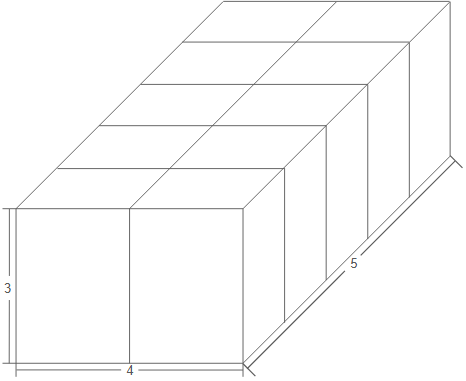

## 문제 설명

크기가 $1\times 2\times 3$인 직육면체를 조합하여 크기가 $A\times B\times C$인 직육면체를 만들 수 있는지 구하세요.

## 입력

입력은 다음 형식으로 표준 입력에서 주어집니다.

```text
$A\ B\ C$
```

## 제한

- $1 \leq A,B,C \leq 10^9$
- $A$, $B$, $C$는 정수입니다.

## 출력

크기가 $A\times B\times C$인 직육면체를 만들 수 있다면 `Yes`를, 만들 수 없다면 `No`를 $1$줄에 출력하세요.

## 예제

### 예제 1 {file=""}

#### 입력

```text
4 5 3
```

#### 출력

```text
Yes
```

아래 그림과 같이 조합하면 크기가 $4\times 5\times 3$인 직육면체를 만들 수 있습니다.



### 예제 2 {file=""}

#### 입력

```text
3 3 3
```

#### 출력

```text
No
```
