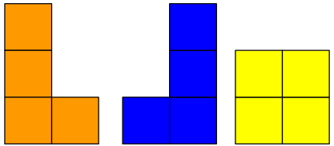
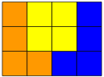
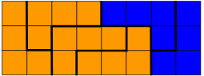

## 문제 설명

세로 $3$칸, 가로 $N$칸인 직사각형 격자가 있습니다. 茶碗蒸し君은 이 격자를 아래 그림과 같은 L자, J자, O자 테트로미노인 $3$가지 종류의 블록으로 빈틈없이 채우려고 합니다. 왼쪽부터 순서대로 L자, J자, O자 테트로미노입니다.



茶碗蒸し君은 L자 블록을 $l$개, J자 블록을 $j$개, O자 블록을 $o$개 가지고 있습니다. 블록은 자유롭게 회전하고 평행이동할 수 있지만, 반전할 수는 없습니다. (L자를 J자로 취급하는 것 등은 할 수 없습니다.)

가지고 있는 모든 블록을 다 사용하고, 격자 밖으로 나가거나 블록끼리 겹치지 않도록 격자를 완전히 채울 수 있는지 판정하세요. 격자의 총 칸 수와 블록의 총 칸 수는 같으므로, 항상 $3N=4(l+j+o)$가 성립하는 것이 보장됩니다.

$T$개의 테스트 케이스가 주어지므로, 각각에 대해 해결하세요.

## 비주얼라이저

[고찰에 활용할 수 있는 비주얼라이저를 만들어 보았습니다.](https://tyawanmusi256.github.io/LoJVisualizer/)

## 입력

입력은 다음 형식으로 표준 입력에서 주어집니다.

```text
$T$
$\text{case}_1$
$\text{case}_2$
$\vdots$
$\text{case}_T$
```

각 테스트 케이스는 다음 형식으로 주어집니다.

```text
$l\ j\ o$
```

## 제한

- $1\le T\le2\times10^5$
- $0\le l,j,o\le10^9$
- $4(l+j+o)$는 $3$의 배수입니다.
- 입력은 모두 정수입니다.

## 출력

격자를 채울 수 있다면 `Yes`를, 불가능하다면 `No`를 출력하세요. 마지막에 개행도 출력하세요.

## 예제

### 예제 1 {file=""}

#### 입력

```text
9
1 1 1
4 2 0
1 3 2
2 1 0
0 5 1
1 7 1
10 2 0
2718 2818 284
3141592 6535897 93238462
```

#### 출력

```text
Yes
Yes
Yes
No
No
Yes
Yes
Yes
No
```

$1$번째 테스트 케이스에서는 아래 그림과 같이 $3\times4$ 격자를 채울 수 있습니다.



$2$번째 테스트 케이스에서는 아래 그림과 같이 $3\times8$ 격자를 채울 수 있습니다.


