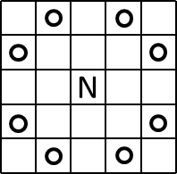
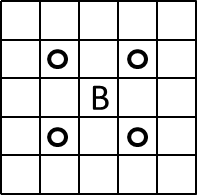

## 이야기

체스 말을 사용하는 게임을 합니다.

## 문제 설명

$H$행 $W$열 체스판에서 말을 시작 칸에서 목표 칸으로 옮기면 게임을 클리어합니다. 처음에는 시작 칸에 말이 놓여 있고, 이 말은 나이트입니다.

체스판의 일부 칸은 빨간 칸입니다. 말이 빨간 칸에 멈추면 나이트가 “미니 비숍”으로 변하고, 미니 비숍일 때 빨간 칸에 멈추면 나이트로 변합니다. (말을 $1$번 움직이는 것을 $1$수라고 합니다.)

- $k$번째 이동을 시작할 때 말이 나이트이고, $k$번째 이동 목적지가 빨간 칸이면 $k+1$번째 이동부터 다음 빨간 칸에 멈출 때까지 말은 미니 비숍입니다.
- $k$번째 이동을 시작할 때 말이 미니 비숍이고, $k$번째 이동 목적지가 빨간 칸이면 $k+1$번째 이동부터 다음 빨간 칸에 멈출 때까지 말은 나이트입니다.

$i$행 $j$열 칸을 $(i,j)$로 나타내면 이동 방법은 다음과 같습니다.

- 나이트가 $(i,j)$에 있으면 $(i\pm1,j\pm2)$ 또는 $(i\pm2,j\pm1)$로 이동할 수 있습니다.
- 미니 비숍이 $(i,j)$에 있으면 $(i\pm1,j\pm1)$로 이동할 수 있습니다.
- 나이트와 미니 비숍 모두 체스판 밖으로 나갈 수 없습니다.

그림으로 나타내면 나이트의 이동 범위(왼쪽)와 미니 비숍의 이동 범위(오른쪽)는 다음과 같습니다. `N`은 나이트(kNight), `B`는 미니 비숍(mini-Bishop)의 위치이며, 동그라미가 그려진 칸은 이동할 수 있는 칸입니다.





게임을 클리어하는 최소 수를 구하세요.

## 입력

```text
$H\ W$
$s_1$
$s_2$
$\vdots$
$s_H$
```

- $1$번째 줄에 체스판의 행 수 $H$와 열 수 $W$가 공백으로 구분된 정수로 주어집니다.
- $2$번째 줄부터 $H+1$번째 줄까지 각 칸의 정보가 주어집니다. $i+1$번째 줄의 문자열 $s_i$의 $j$번째 문자가 $i$행 $j$열 칸을 나타냅니다.
- `S`는 시작 칸, `G`는 목표 칸, `R`은 빨간 칸, `.`은 그 밖의 칸입니다.
- `S`와 `G`는 각각 정확히 $1$개 존재하며 그 밖의 문자는 나타나지 않습니다.

## 제한

- $1\le H,W\le500$

## 출력

시작 칸에서 목표 칸까지 말을 옮기는 최소 수를 $1$줄에 출력하세요. 도달할 수 없으면 $-1$을 출력하세요. 마지막에 개행하세요.

## 예제

### 예제 1 {file=""}

#### 입력

```text
4 4
...G
.RR.
.RR.
S...
```

#### 출력

```text
3
```

예를 들어 $(4,1)\to(2,2)\to(3,3)\to(1,4)$로 이동하면 최소 수로 클리어할 수 있습니다. 말은 나이트 → 미니 비숍 → 나이트로 변합니다.

### 예제 2 {file=""}

#### 입력

```text
3 4
...G
....
S...
```

#### 출력

```text
3
```

빨간 칸이 없습니다. $(3,1)\to(1,2)\to(3,3)\to(1,4)$로 이동하면 최소 수로 클리어할 수 있습니다.

### 예제 3 {file=""}

#### 입력

```text
3 3
.R.
RGR
SR.
```

#### 출력

```text
-1
```

목표 칸에 도달할 수 없습니다.
