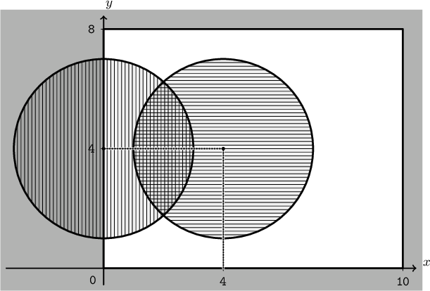

## 문제 설명

$xy$ 평면 위에 가로 길이가 $X$, 세로 길이가 $Y$인 축에 평행한 직사각형 창이 있습니다.

창이 차지하는 영역은 $[0,X] \times [0,Y]$입니다.

이 창에는 단위 면적당 광량이 $1$인 균일한 빛이 입사합니다.

창 앞에는 $N$개의 원형 편광판이 있습니다.

$i\ (1 \leq i \leq N)$번째 편광판은 중심이 $(x_i,y_i)$이고 반지름이 $r_i$인 원판이며, 편광 방향 $d_i$는 세로 방향을 나타내는 `V` 또는 가로 방향을 나타내는 `H`입니다.

편광판은 창의 영역에서 일부 또는 전부가 벗어날 수 있지만, 창 바깥 영역은 광량 계산 대상에 포함하지 않습니다.

창 안의 각 점을 통과하는 광량은 다음 규칙으로 정의됩니다.

- 어떤 편광판에도 덮이지 않은 점에서는 $1$
- 편광 방향이 `V`인 편광판에 $1$장 이상 덮이고, 편광 방향이 `H`인 편광판에는 덮이지 않은 점에서는 $1/2$
- 편광 방향이 `H`인 편광판에 $1$장 이상 덮이고, 편광 방향이 `V`인 편광판에는 덮이지 않은 점에서는 $1/2$
- 편광 방향이 `V`인 편광판과 편광 방향이 `H`인 편광판에 각각 $1$장 이상 덮인 점에서는 $0$

창 전체를 통과하는 광량의 총합, 즉 각 점을 통과하는 광량을 창 전체 영역에서 적분한 값을 구하세요.

## 입력

입력은 다음 형식으로 표준 입력에서 주어집니다.

```text
$X\ Y\ N$
$x_1\ y_1\ r_1\ d_1$
$x_2\ y_2\ r_2\ d_2$
$\vdots$
$x_N\ y_N\ r_N\ d_N$
```

## 제한

- $1\leq X,Y\leq 10^6$
- $0\leq N\leq 2\,000$
- $-10^6\leq x_i,y_i\leq 10^6$
- $1\leq r_i\leq 10^6$
- $d_i$는 `V` 또는 `H`입니다.
- 입력되는 수치는 모두 정수입니다.

## 출력

창 전체를 통과하는 광량의 총합을 출력하고, 마지막에 개행을 출력하세요.

출력한 값과 기준값의 절대 오차 또는 상대 오차가 $10^{-6}$ 이하이면 정답으로 판정됩니다.

저지가 보유한 기준값과 참값의 절대 오차는 $10^{-50}$ 이하임이 보장됩니다.

## 예제

### 예제 1 {file=""}

#### 입력

```text
10 8 2
0 4 3 V
4 4 3 H
```

#### 출력

```text
58.794249588268896
```

편광판과 창의 위치 관계는 다음 그림과 같습니다.



### 예제 2 {file=""}

#### 입력

```text
10 10 1
5 5 2 V
```

#### 출력

```text
93.716814692820414
```

편광판은 창 안에 들어 있습니다. 원판의 넓이 $4\pi$인 부분만 통과하는 광량이 $1/2$가 됩니다.

### 예제 3 {file=""}

#### 입력

```text
12 7 0
```

#### 출력

```text
84.000000000000000
```

편광판이 없으므로 창의 모든 점에서 통과하는 광량은 $1$입니다.

### 예제 4 {file=""}

#### 입력

```text
10 10 2
5 5 2 V
5 5 2 H
```

#### 출력

```text
87.433629385640828
```

편광판 $2$장이 같은 위치에 정확히 겹쳐 있으므로 그 원의 내부에서는 $2$가지 방향의 편광판에 모두 덮이고, 통과하는 광량은 $0$이 됩니다.

### 예제 5 {file=""}

#### 입력

```text
10 10 2
5 5 2 V
5 5 2 V
```

#### 출력

```text
93.716814692820414
```

같은 방향의 편광판 $2$장이 같은 위치에 정확히 겹쳐 있습니다. 겹친 부분을 통과하는 광량은 그대로 $1/2$입니다.

### 예제 6 {file=""}

#### 입력

```text
5 7 1
2 3 100 V
```

#### 출력

```text
17.500000000000000
```

편광판이 창보다 훨씬 크고 창 전체를 덮습니다. 따라서 통과하는 광량의 총합은 $5 \times 7 \times 1/2 = 17.5$입니다.
