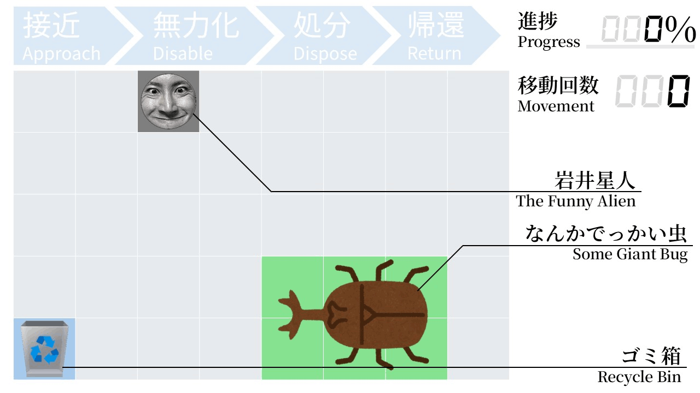
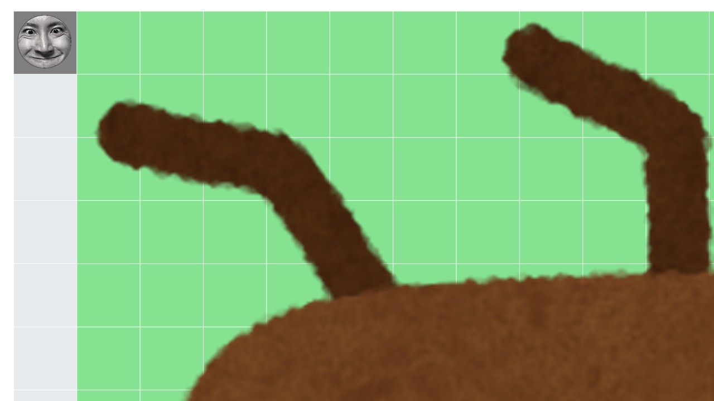

## 문제 설명

岩井星人さん의 방 구조는 세로 $H$칸, 가로 $W$칸의 격자로 나타낼 수 있습니다.

이후 이 격자의 위에서 $i$번째, 왼쪽에서 $j$번째 칸을 칸 $(i,j)$라고 합니다.

처음에 岩井星人さん은 칸 $(A,B)$에서 동영상을 촬영하고 있으며, **[뭔가 커다란 벌레](https://youtu.be/A1tZhktmxls?t=924)**는 칸 $(R_1,C_1)$을 왼쪽 위, 칸 $(R_2,C_2)$를 오른쪽 아래로 하는 직사각형 영역을 차지하고 있습니다. 岩井星人さん은 이제 다음 절차로 이 **뭔가 커다란 벌레**를 퇴치합니다.

1. 접근: **뭔가 커다란 벌레**가 차지하는 칸 중 $1$개에 도달할 때까지 이동을 반복합니다.
2. 무력화: **뭔가 커다란 벌레**의 숨통을 끊고, 사체를 회수합니다.
3. 처분: 칸 $(P,Q)$에 있는 쓰레기통에 도달할 때까지 이동을 반복한 다음, **뭔가 커다란 벌레**의 사체를 버립니다.
4. 귀환: 칸 $(A,B)$에 도달할 때까지 이동을 반복합니다.

岩井星人さん은 동영상의 완성도를 걱정하고 있어, 이 **뭔가 커다란 벌레**를 가능한 한 솜씨 좋게 퇴치하고 싶습니다. 이 **뭔가 커다란 벌레**를 퇴치하는 데 필요한 이동 횟수의 최솟값을 구하세요.

또한 岩井星人さん이 칸 $(i,j)$에 있을 때 $1$회 이동하면, 칸이 존재하는 경우 칸 $(i-1,j)$, $(i+1,j)$, $(i,j-1)$, $(i,j+1)$ 중 $1$개에 도달할 수 있습니다.

## 입력

입력은 다음 형식으로 표준 입력에서 주어집니다.

```text
$H\ W$
$A\ B$
$R_1\ C_1\ R_2\ C_2$
$P\ Q$
```

## 제한

- $1 \leq H \leq 200$
- $1 \leq W \leq 200$
- $1 \leq A \leq H$
- $1 \leq B \leq W$
- $1 \leq R_1 \leq R_2 \leq H$
- $1 \leq C_1 \leq C_2 \leq W$
- $1 \leq P \leq H$
- $1 \leq Q \leq W$
- 입력은 모두 정수입니다.

## 출력

답을 출력하세요.

## 예제

### 예제 1 {file="00_sample_01.txt"}

#### 입력

```text
5 8
1 3
4 5 5 7
5 1
```

#### 출력

```text
16
```



위 애니메이션은 다음 움직임을 시각화한 것입니다.

처음에 岩井星人さん은 칸 $(1,3)$에서 동영상을 촬영하고 있습니다.

아래 방향으로 $4$회 이동을 반복하여 칸 $(5,3)$에 도달합니다.

오른쪽 방향으로 $2$회 이동을 반복하여 칸 $(5,5)$에 도달합니다.

칸 $(5,5)$는 **뭔가 커다란 벌레**가 차지하는 영역의 일부이므로, 여기서 「무력화」를 수행합니다.

왼쪽 방향으로 $4$회 이동을 반복하여 칸 $(5,1)$에 도달합니다.

칸 $(5,1)$은 쓰레기통이 있는 칸이므로, 여기서 **뭔가 커다란 벌레**의 사체를 버립니다.

오른쪽 방향으로 $2$회 이동을 반복하여 칸 $(5,3)$에 도달합니다.

위 방향으로 $4$회 이동을 반복하여 칸 $(1,3)$에 도달합니다.

칸 $(1,3)$은 원래 동영상을 촬영하던 칸이므로, 이로써 **뭔가 커다란 벌레**의 퇴치를 완료합니다.

이 애니메이션처럼 이동을 반복하면 $16$회의 이동으로 **뭔가 커다란 벌레**를 솜씨 좋게 퇴치할 수 있습니다. $15$회 이하의 이동으로 **뭔가 커다란 벌레**를 퇴치할 수는 없으므로, 답은 $16$입니다.

### 예제 2 {file="00_sample_02.txt"}

#### 입력

```text
200 200
1 1
1 2 200 200
200 1
```

#### 출력

```text
400
```



岩井星人さん의 방의 $99.5$%를 **뭔가 커다란 벌레**가 차지하는 경우도 있습니다.

### 예제 3 {file="00_sample_03.txt"}

#### 입력

```text
1 1
1 1
1 1 1 1
1 1
```

#### 출력

```text
0
```

岩井星人さん이 동영상을 촬영하는 칸 $(A,B)$, **뭔가 커다란 벌레**가 차지하는 직사각형 영역, 쓰레기통이 있는 칸 $(P,Q)$가 서로 겹치는 경우에 주의하세요.
