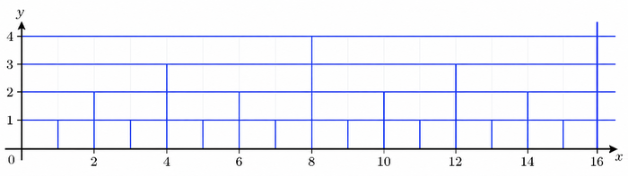
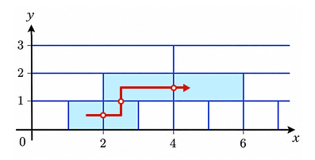

## 이야기

세그먼트 트리처럼 구분된 낚시터가 있습니다.

岩井星人さん은 이곳에서 동료와 [세그먼트 낚시](https://youtu.be/qZt3BbQV3nQ?t=150)를 하기로 약속했지만, [지각할 것 같습니다](https://youtu.be/qZt3BbQV3nQ?t=500&si=RELQuY_bW5d8vhzE).

岩井星人さん이 지각하지 않도록 낚시터 안을 이동하는 최소 비용을 구하세요.

## 문제 설명

$xy$ 평면에서 $x$ 좌표와 $y$ 좌표가 모두 음이 아닌 영역에 다음 규칙으로 타일이 배치되어 있습니다.

- 음이 아닌 정수쌍 $(i, j)$에 대해 정사각형 $A_{i, j} = \{(x, y) ~ | ~ i \leq x \leq i + 1 ~ \land ~ j \leq y \leq j + 1\}$는 $1$개의 타일에 포함됩니다.
- $2$개의 음이 아닌 정수쌍 $(i, j)$, $(i', j')$에 대해 $j = j'$ 및 $\lfloor i / 2^j \rfloor = \lfloor i' / 2^{j'} \rfloor$를 만족할 때, 그리고 그때에만 $A_{i, j}$와 $A_{i', j'}$는 같은 타일에 포함됩니다.

단, 타일은 경계를 포함하며 공통 부분의 넓이가 양수인 서로 다른 $2$개의 타일은 존재하지 않는다고 합니다.



岩井星人さん은 처음에 좌표 $(S_x + 0.5, S_y + 0.5)$에 있습니다.

岩井星人さん은 다음 행동을 $0$회 이상 원하는 횟수만큼 수행할 수 있습니다.

岩井星人さん이 좌표 $(x, y)$에 있을 때, 좌표 $(x + 1, y)$, $(x - 1, y)$, $(x, y + 1)$, $(x, y - 1)$ 중 $1$곳으로 이동합니다. 단, 이동 후 $x$ 좌표 또는 $y$ 좌표가 음수가 되는 이동은 할 수 없습니다.

岩井星人さん은 서로 다른 타일을 지날 때마다 비용을 $1$ 지불합니다.

좌표 $(T_x + 0.5, T_y + 0.5)$에 도달하기 위해 岩井星人さん이 지불해야 하는 비용의 총합의 최솟값을 구하세요.

$T$개의 테스트 케이스가 주어지므로, 각각에 대해 답을 구하세요.

## 입력

입력은 다음 형식으로 표준 입력에서 주어집니다.

```text
$T$
$\mathrm{case}_1$
$\mathrm{case}_2$
$\vdots$
$\mathrm{case}_T$
```

각 테스트 케이스는 다음 형식으로 주어집니다.

```text
$S_x\ S_y\ T_x\ T_y$
```

## 제한

- 입력되는 값은 모두 정수입니다.
- $1 \leq T \leq 10^5$
- $0 \leq S_x, S_y, T_x, T_y \leq 10^{18}$
- $(S_x, S_y) \ne (T_x, T_y)$

## 출력

각 테스트 케이스에 대한 답을 순서대로 줄바꿈으로 구분하여 출력하세요.

## 예제

### 예제 1 {file="01_sample_01.txt"}

#### 입력

```text
3
1 0 4 1
2 4 15 4
0 0 1000000000000000000 1000000000000000000
```

#### 출력

```text
3
0
1000000000000000000
```

$1$번째 테스트 케이스에서는 다음과 같이 행동하면 비용 $3$을 달성할 수 있습니다.



- 좌표 $(1.5, 0.5)$에서 좌표 $(2.5, 0.5)$로 이동합니다. 비용을 $1$ 지불합니다.
- 좌표 $(2.5, 0.5)$에서 좌표 $(2.5, 1.5)$로 이동합니다. 비용을 $1$ 지불합니다.
- 좌표 $(2.5, 1.5)$에서 좌표 $(3.5, 1.5)$로 이동합니다. 비용을 지불하지 않습니다.
- 좌표 $(3.5, 1.5)$에서 좌표 $(4.5, 1.5)$로 이동합니다. 비용을 $1$ 지불합니다.

비용 $2$ 이하로는 달성할 수 없으므로 답은 $3$입니다.
