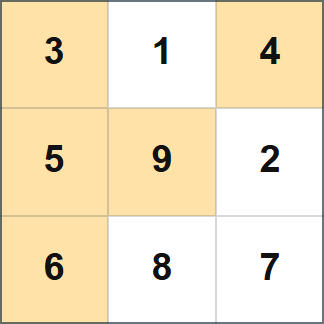

## 문제 설명

$N\times N$ 격자의 각 칸에 다음 두 조건을 만족하도록 정수를 적습니다.

- 각 칸에는 정확히 하나의 정수가 적혀 있습니다.
- $1$ 이상 $N^2$ 이하의 각 정수는 정확히 한 칸에 적혀 있습니다.

즉, $1$ 이상 $N^2$ 이하의 정수 $N^2$개와 칸 $N^2$개가 일대일로 대응하도록 적습니다.

위에서 $i$번째 행, 왼쪽에서 $j$번째 열의 칸을 $(i,j)$, 그 칸에 적힌 정수를 $A_{i,j}$라고 합니다. 다음 조건을 만족하는 정수 쌍 $(i,j)$ $(1\leq i,j\leq N)$가 정확히 $K$개가 되도록 적는 방법을 하나 구하세요.

- 칸 $(1,1)$을 왼쪽 위 꼭짓점, 칸 $(i,j)$를 오른쪽 아래 꼭짓점으로 하는 직사각형 영역에 적힌 정수의 최댓값이 $A_{i,j}$입니다. 엄밀히 말해 $\displaystyle \max_{\substack{1 \leq r \leq i \\ 1 \leq c \leq j}} A_{r,c} = A_{i,j}$가 성립합니다.

그러한 방법이 없으면 $-1$을 출력하세요.

## 입력

표준 입력으로 다음 형식의 입력이 주어집니다.

```text
$N\ K$
```

## 제한

- 입력으로 주어지는 모든 수는 정수입니다.
- $1\leq N\leq 1\,000$
- $0\leq K\leq N^2$

## 출력

조건을 만족하는 정수 쌍 $(i,j)$ $(1\leq i,j\leq N)$가 정확히 $K$개가 되도록 적는 방법이 있으면, 다음 형식으로 하나를 출력하세요. 없으면 $-1$을 출력하세요.

```text
$A_{1, 1}\ A_{1, 2}\ \ldots\ A_{1, N}$
$A_{2, 1}\ A_{2, 2}\ \ldots\ A_{2, N}$
$\vdots$
$A_{N, 1}\ A_{N, 2}\ \ldots\ A_{N, N}$
```

마지막에 줄바꿈을 출력하세요.

### 시각화 도구

출력 결과를 확인할 수 있는 [웹 시각화 도구](https://contest.d1y3nqydzefx1p.amplifyapp.com/A/index.html)가 제공됩니다.

대회 중에는 시각화 결과를 공유하거나 풀이·고찰을 언급하는 것이 금지됩니다. 주의하세요.

시각화 도구의 사양에 관한 질문은 원칙적으로 받지 않습니다. 보조 도구로만 사용하세요.

## 예제

### 예제 1 {file=""}

#### 입력

```text
3 5
```

#### 출력

```text
3 1 4
5 9 2
6 8 7
```

$(i,j)=(1,1),(1,3),(2,1),(2,2),(3,1)$의 $5$개 쌍이 조건을 만족하며, 아래 그림의 노란 칸 $5$개에 해당합니다.



### 예제 2 {file=""}

#### 입력

```text
1 0
```

#### 출력

```text
-1
```
