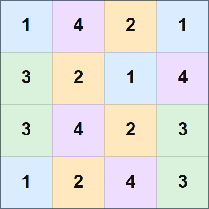

## 문제 설명

$N\times N$ 격자의 각 칸에 $1$ 이상 $M$ 이하의 정수를 하나씩 적습니다. $1$ 이상 $M$ 이하의 각 정수가 적힌 칸은 격자 전체에서 정확히 $\frac{N^2}{M}$개여야 합니다.

모든 $K\times K$ 부분 격자에 $1$부터 $M$까지 $M$종류의 정수가 모두 포함되도록 적는 방법을 하나 구하세요. 그러한 방법이 없으면 $-1$을 출력하세요.

단, **$M$은 $N$의 약수입니다.**

<details>
<summary>$K\times K$ 부분 격자란?</summary>

$K\times K$ 부분 격자는 연속한 $K$개 행과 연속한 $K$개 열이 겹치는 정사각형 영역입니다. 즉, $1\leq i,j\leq N-K+1$인 정수 쌍 $(i,j)$에 대해 위에서 $i$번째부터 $i+K-1$번째 행, 왼쪽에서 $j$번째부터 $j+K-1$번째 열까지 포함되는 $K^2$개 칸의 영역이며, 총 $(N-K+1)^2$개 있습니다.

</details>

## 입력

표준 입력으로 다음 형식의 입력이 주어집니다.

```text
$N\ M\ K$
```

## 제한

- 입력으로 주어지는 모든 수는 정수입니다.
- $1\leq K\leq N\leq 1\,000$
- $1\leq M\leq K^2$
- **$M$은 $N$의 약수입니다.**

## 출력

조건을 만족하는 방법이 있으면 다음 형식으로 하나를 출력하세요. $A_{i,j}$는 위에서 $i$번째 행, 왼쪽에서 $j$번째 열의 칸에 적는 정수입니다. 그러한 방법이 없으면 $-1$을 출력하세요.

```text
$A_{1, 1}\ A_{1, 2}\ \ldots\ A_{1, N}$
$A_{2, 1}\ A_{2, 2}\ \ldots\ A_{2, N}$
$\vdots$
$A_{N, 1}\ A_{N, 2}\ \ldots\ A_{N, N}$
```

마지막에 줄바꿈을 출력하세요.

### 시각화 도구

출력 결과를 확인할 수 있는 [웹 시각화 도구](https://contest.d1y3nqydzefx1p.amplifyapp.com/B/index.html)가 제공됩니다.

대회 중에는 시각화 결과를 공유하거나 풀이·고찰을 언급하는 것이 금지됩니다. 주의하세요.

시각화 도구의 사양에 관한 질문은 원칙적으로 받지 않습니다. 보조 도구로만 사용하세요.

## 예제

### 예제 1 {file=""}

#### 입력

```text
4 4 3
```

#### 출력

```text
1 4 2 1
3 2 1 4
3 4 2 3
1 2 4 3
```

$3\times 3$ 부분 격자는 $4$개이며, 모두 $1$부터 $4$까지의 $4$종류 정수를 포함합니다. 격자 전체에도 각 숫자가 정확히 $4$개씩 적혀 있으므로 정답입니다.



### 예제 2 {file=""}

#### 입력

```text
3 1 2
```

#### 출력

```text
1 1 1
1 1 1
1 1 1
```

$1$만 적을 수 있으므로 이것이 유일한 답입니다.
