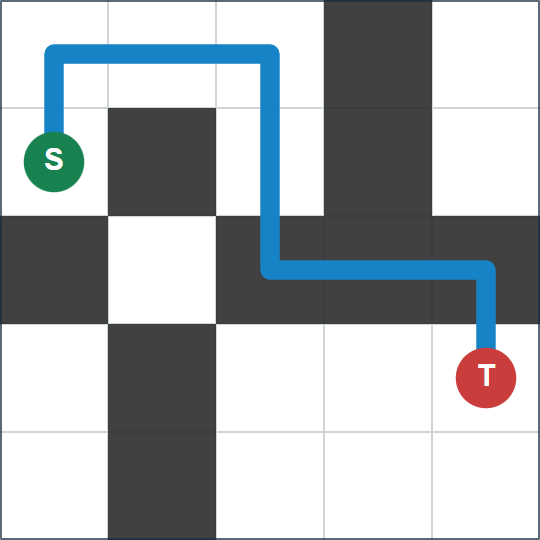

## 문제 설명

모든 칸이 흰색인 $N\times N$ 격자 위에 Alice가 있습니다. 위에서 $i$번째 행, 왼쪽에서 $j$번째 열의 칸을 $(i,j)$라고 할 때, Alice의 현재 위치는 $(s_r,s_c)$입니다.

Alice는 상하좌우로 인접한 칸으로 이동하기를 반복해 목적지 $(t_r,t_c)$로 가려고 합니다. 이를 본 Bob은 몇몇 칸을 검게 칠해 Alice를 멀리 돌아가게 하는 장난을 치기로 했습니다.

흰색에서 흰색, 검은색에서 검은색처럼 같은 색의 칸으로 이동하는 데는 $1$의 시간이 걸립니다. 흰색에서 검은색, 검은색에서 흰색처럼 다른 색의 칸으로 이동하는 데는 $2$의 시간이 걸립니다.

Bob은 **Alice의 현재 위치와 목적지를 제외한** 칸을 원하는 만큼 검게 칠할 수 있습니다. Alice가 현재 위치에서 목적지까지 이동하는 최소 시간이 정확히 $K$가 되려면 어디를 칠해야 할까요?

Bob 대신 방법을 구하세요. 조건을 만족하는 방법이 없으면 $-1$을 출력하세요.

## 입력

표준 입력으로 다음 형식의 입력이 주어집니다.

```text
$N\ K$
$s_r\ s_c$
$t_r\ t_c$
```

## 제한

- 입력으로 주어지는 모든 수는 정수입니다.
- $2\leq N\leq 1\,000$
- $1\leq K\leq 10^9$
- $1\leq s_r,s_c,t_r,t_c\leq N$
- $(s_r,s_c)\neq(t_r,t_c)$

## 출력

조건을 만족하는 방법이 있으면 다음 형식으로 하나를 출력하세요. $S_i$는 길이 $N$의 문자열이며, $j$번째 문자는 위에서 $i$번째 행, 왼쪽에서 $j$번째 열의 칸이 검은색이면 `#`, 흰색이면 `.`입니다. 조건을 만족하는 방법이 없으면 $-1$을 출력하세요.

```text
$S_1$
$S_2$
$\vdots$
$S_N$
```

마지막에 줄바꿈을 출력하세요.

### 시각화 도구

출력 결과를 확인할 수 있는 [웹 시각화 도구](https://contest.d1y3nqydzefx1p.amplifyapp.com/C/index.html)가 제공됩니다.

대회 중에는 시각화 결과를 공유하거나 풀이·고찰을 언급하는 것이 금지됩니다. 주의하세요.

시각화 도구의 사양에 관한 질문은 원칙적으로 받지 않습니다. 보조 도구로만 사용하세요.

## 예제

### 예제 1 {file=""}

#### 입력

```text
5 10
2 1
4 5
```

#### 출력

```text
...#.
.#.#.
#.###
.#...
.#...
```

출력 예에서 이동 시간이 최소인 경로의 한 예는 아래 그림과 같으며, $(2,1)\rightarrow(1,1)\rightarrow(1,2)\rightarrow(1,3)\rightarrow(2,3)\rightarrow(3,3)\rightarrow(3,4)\rightarrow(3,5)\rightarrow(4,5)$입니다.



### 예제 2 {file=""}

#### 입력

```text
2 3
1 1
2 2
```

#### 출력

```text
-1
```

Alice의 현재 위치와 목적지는 검게 칠할 수 없다는 점에 주의하세요.
