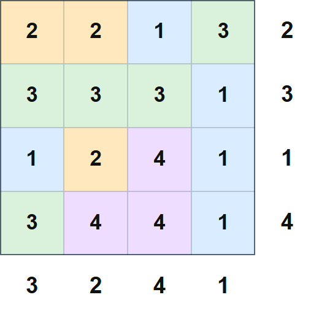

## 문제 설명

길이 $N$의 수열 $R=(R_1,R_2,\ldots,R_N)$과 $C=(C_1,C_2,\ldots,C_N)$이 주어집니다. **$R$은 $1,2,\ldots,N$의 순열입니다.**

$N\times N$ 격자의 각 칸에 $1$ 이상 $N$ 이하의 정수를 적습니다. 다음 조건을 모두 만족하는 방법을 하나 구하세요. 없으면 $-1$을 출력하세요.

- $1\leq i\leq N$에 대해 $i$번째 행에 적힌 $N$개 정수의 **유일한 최빈값**은 $R_i$입니다.
- $1\leq i\leq N$에 대해 $i$번째 열에 적힌 $N$개 정수의 **유일한 최빈값**은 $C_i$입니다.

테스트 케이스가 $T$개 주어집니다. 각각 답을 출력하세요.

## 입력

표준 입력으로 다음 형식의 입력이 주어집니다. $case_i$는 $i$번째 테스트 케이스입니다.

```text
$T$
$case_1$
$case_2$
$\vdots$
$case_T$
```

각 테스트 케이스는 다음 형식으로 주어집니다.

```text
$N$
$R_1\ R_2\ \ldots\ R_N$
$C_1\ C_2\ \ldots\ C_N$
```

## 제한

- 입력으로 주어지는 모든 수는 정수입니다.
- $1\leq T\leq 10^5$
- $1\leq N\leq 1\,000$
- **$R$은 $1,2,\ldots,N$의 순열입니다.**
- $1\leq C_i\leq N$
- 한 입력 파일에서 $N^2$의 합은 $10^6$ 이하입니다.

### 부분 점수

이 문제에는 서브태스크에 따른 부분 점수가 있습니다.

| 서브태스크 | 배점 | 제한 |
| --- | --- | --- |
| 부분 점수 | $20$% ($50$점) | $C$는 $1,2,\cdots,N$의 순열입니다. |
| 만점 | $80$% ($200$점) | 추가 제한이 없습니다. |

## 출력

각 테스트 케이스에 대해 조건을 만족하는 방법이 없으면 $-1$을, 있으면 다음 형식으로 하나를 출력하세요. $A_{i,j}$는 위에서 $i$번째 행, 왼쪽에서 $j$번째 열의 칸에 적는 정수입니다.

```text
$A_{1, 1}\ A_{1, 2}\ \ldots\ A_{1, N}$
$A_{2, 1}\ A_{2, 2}\ \ldots\ A_{2, N}$
$\vdots$
$A_{N, 1}\ A_{N, 2}\ \ldots\ A_{N, N}$
```

각 테스트 케이스의 출력 마지막에 줄바꿈을 출력하세요.

### 시각화 도구

출력 결과를 확인할 수 있는 [웹 시각화 도구](https://contest.d1y3nqydzefx1p.amplifyapp.com/D/index.html)가 제공됩니다.

대회 중에는 시각화 결과를 공유하거나 풀이·고찰을 언급하는 것이 금지됩니다. 주의하세요.

시각화 도구의 사양에 관한 질문은 원칙적으로 받지 않습니다. 보조 도구로만 사용하세요.

## 예제

### 예제 1 {file=""}

#### 입력

```text
2
4
2 3 1 4
3 2 4 1
2
1 2
2 1
```

#### 출력

```text
2 2 1 3
3 3 3 1
1 2 4 1
3 4 4 1
-1
```

각 행과 각 열에서 주어진 값이 **유일한 최빈값**이어야 한다는 점에 주의하세요.

$1$번째 테스트 케이스의 출력 예가 나타내는 격자와 각 행·열의 최빈값은 다음 그림과 같습니다.



이 테스트 케이스는 부분 점수 케이스에 포함됩니다.

### 예제 2 {file=""}

#### 입력

```text
1
3
2 1 3
3 3 1
```

#### 출력

```text
2 3 2
3 1 1
3 3 1
```

이 테스트 케이스는 부분 점수 케이스에 포함되지 않습니다.
