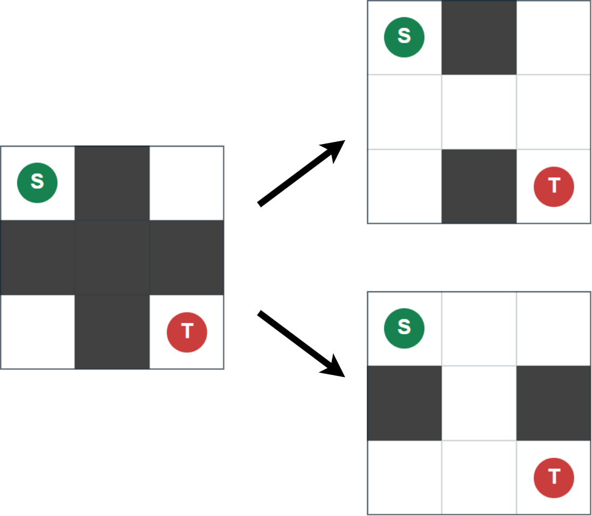

## 문제 설명

Alice와 Bob이 $N\times N$ 격자에서 게임을 합니다. $i$번째 행, $j$번째 열의 칸을 $(i,j)$라고 합니다.

게임은 다음 순서로 진행합니다.

1. Alice가 각 칸을 흰색 또는 검은색으로 칠합니다. 단, $(1,1)$과 $(N,N)$은 반드시 흰색이어야 하며, 이 시점에는 흰 칸만 지나서 두 칸을 오갈 수 없어야 합니다.
2. Bob이 다음 두 행동 중 **하나만 골라** 합니다.
   - $2\leq i\leq j\leq N-1$인 쌍 $(i,j)$를 골라, 위에서 $i$번째부터 $j$번째까지 $j-i+1$개 행에 포함된 모든 칸의 색을 반전합니다. 흰색은 검은색으로, 검은색은 흰색으로 바꿉니다.
   - $2\leq i\leq j\leq N-1$인 쌍 $(i,j)$를 골라, 왼쪽에서 $i$번째부터 $j$번째까지 $j-i+1$개 열에 포함된 모든 칸의 색을 반전합니다. 흰색은 검은색으로, 검은색은 흰색으로 바꿉니다.
3. 흰 칸만 지나서 $(1,1)$과 $(N,N)$을 오갈 수 있으면 Alice가, 그렇지 않으면 Bob이 이깁니다.

Bob이 어떻게 행동하더라도 Alice가 이기도록 단계 $1$에서 칠하는 방법이 있을까요? 있으면 하나를 출력하고, 없으면 $-1$을 출력하세요.

흰 칸만 지나서 $(1,1)$과 $(N,N)$을 오갈 수 있다는 것은 $(1,1)$에서 상하좌우로 인접한 흰 칸으로 이동하기를 반복해 $(N,N)$에 도달할 수 있다는 뜻입니다.

## 입력

표준 입력으로 다음 형식의 입력이 주어집니다.

```text
$N$
```

## 제한

- $N$은 정수입니다.
- $3\leq N\leq 100$

## 출력

조건을 만족하는 방법이 있으면 다음 형식으로 하나를 출력하세요. $S_i$ $(1\leq i\leq N)$는 길이 $N$의 문자열이며, $j$번째 문자는 위에서 $i$번째 행, 왼쪽에서 $j$번째 열의 칸이 흰색이면 `.`, 검은색이면 `#`여야 합니다. 조건을 만족하는 방법이 없으면 $-1$을 출력하세요.

```text
$S_1$
$S_2$
$\vdots$
$S_N$
```

마지막에 줄바꿈을 출력하세요.

### 시각화 도구

출력 결과를 확인할 수 있는 [웹 시각화 도구](https://contest.d1y3nqydzefx1p.amplifyapp.com/E/index.html)가 제공됩니다.

대회 중에는 시각화 결과를 공유하거나 풀이·고찰을 언급하는 것이 금지됩니다. 주의하세요.

시각화 도구의 사양에 관한 질문은 원칙적으로 받지 않습니다. 보조 도구로만 사용하세요.

## 예제

### 예제 1 {file=""}

#### 입력

```text
3
```

#### 출력

```text
.#.
###
.#.
```

Bob은 $2$번째 행의 색을 반전하거나 $2$번째 열의 색을 반전할 수 있습니다. 어느 쪽이든 흰 칸만 지나서 $(1,1)$과 $(N,N)$을 오갈 수 있게 됩니다.


