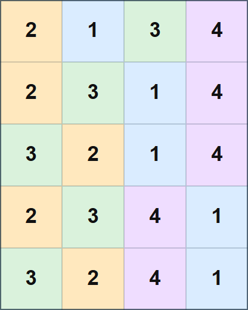

## 문제 설명

$(N+1)\times N$ 격자가 있습니다. 위에서 $i$번째 행, 왼쪽에서 $j$번째 열의 칸을 $(i,j)$라고 합니다.

$(1,2,\ldots,N)$의 순열 $A=(A_1,A_2,\ldots,A_N)$과 $B=(B_1,B_2,\ldots,B_N)$이 주어집니다.

현재 첫째 행에는 순열 $A$, $N+1$번째 행에는 순열 $B$가 적혀 있습니다. 즉, $i=1,2,\ldots,N$에 대해 칸 $(1,i)$에는 $A_i$, 칸 $(N+1,i)$에는 $B_i$가 적혀 있고, 나머지 칸은 비어 있습니다.

빈칸 모두에 $1$ 이상 $N$ 이하의 정수를 적어, 각 $i=1,2,\ldots,N$에 대해 $i$가 적힌 칸 전체가 $8$방향으로 연결되게 할 수 있을까요?

$k$가 적힌 칸 전체가 $8$방향으로 연결되었다는 것은 $k$가 적힌 임의의 두 칸 사이를, 상하좌우와 대각선으로 인접한 $k$가 적힌 칸으로 이동하기를 반복해 오갈 수 있다는 뜻입니다.

가능하면 정수를 적는 방법을 하나 구하고, 불가능하면 $-1$을 출력하세요.

## 입력

표준 입력으로 다음 형식의 입력이 주어집니다.

```text
$N$
$A_1\ A_2\ \ldots\ A_N$
$B_1\ B_2\ \ldots\ B_N$
```

## 제한

- 입력으로 주어지는 모든 수는 정수입니다.
- $2\leq N\leq 500$
- $A$는 $1,2,\ldots,N$의 순열입니다.
- $B$는 $1,2,\ldots,N$의 순열입니다.

## 출력

조건을 만족하는 방법이 있으면 다음 형식으로 하나를 출력하세요. $C_{i,j}$는 위에서 $i$번째 행, 왼쪽에서 $j$번째 열의 칸에 적는 정수입니다. 조건을 만족하는 방법이 없으면 $-1$을 출력하세요.

```text
$C_{1, 1}\ C_{1, 2}\ \ldots\ C_{1, N}$
$C_{2, 1}\ C_{2, 2}\ \ldots\ C_{2, N}$
$\vdots$
$C_{N+1, 1}\ C_{N+1, 2}\ \ldots\ C_{N+1, N}$
```

$i=1,2,\ldots,N$에 대해 $C_{1,i}=A_i, C_{N+1,i}=B_i$여야 한다는 점에 주의하세요.

마지막에 줄바꿈을 출력하세요.

### 시각화 도구

출력 결과를 확인할 수 있는 [웹 시각화 도구](https://contest.d1y3nqydzefx1p.amplifyapp.com/F/index.html)가 제공됩니다.

대회 중에는 시각화 결과를 공유하거나 풀이·고찰을 언급하는 것이 금지됩니다. 주의하세요.

시각화 도구의 사양에 관한 질문은 원칙적으로 받지 않습니다. 보조 도구로만 사용하세요.

## 예제

### 예제 1 {file=""}

#### 입력

```text
4
2 1 3 4
3 2 4 1
```

#### 출력

```text
2 1 3 4
2 3 1 4
3 2 1 4
2 3 4 1
3 2 4 1
```

출력 예가 나타내는 격자는 다음과 같습니다.


