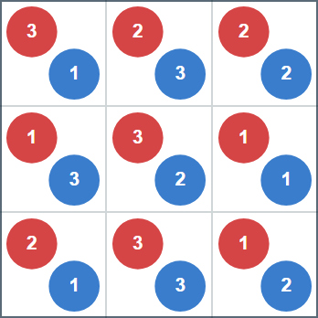

## 문제 설명

$N\times N$ 격자 모양의 화단이 있습니다. 정원사인 당신은 각 칸에 빨간 장미와 파란 장미를 심기로 했습니다.

예술적인 화단을 만들기 위해 다음 조건을 모두 만족하는 방법을 하나 구하세요.

- 각 칸에 심는 빨간 장미와 파란 장미는 각각 $1$송이 이상 $N$송이 이하입니다.
- 각 칸의 (빨간 장미 수, 파란 장미 수) 쌍은 모두 다릅니다. 즉, 서로 다른 두 칸에서 이 쌍이 같아서는 안 됩니다.
- 임의의 $2\times 2$로 배치된 네 칸에서 빨간 장미의 합과 파란 장미의 합이 같습니다. 여기서 네 칸은 연속한 두 행과 연속한 두 열이 겹치는 영역이며, 총 $(N-1)^2$개 있습니다.

그러한 방법이 없으면 $-1$을 출력하세요.

## 입력

표준 입력으로 다음 형식의 입력이 주어집니다.

```text
$N$
```

## 제한

- $N$은 정수입니다.
- $2\leq N\leq 500$

## 출력

조건을 만족하는 방법이 있으면 다음 형식으로 하나를 출력하세요. 위에서 $i$번째 행, 왼쪽에서 $j$번째 열의 칸에 심는 빨간 장미 수를 $R_{i,j}$, 파란 장미 수를 $B_{i,j}$라고 합니다. 조건을 만족하는 방법이 없으면 $-1$을 출력하세요.

```text
$R_{1, 1}\ R_{1, 2}\ \ldots\ R_{1, N}$
$R_{2, 1}\ R_{2, 2}\ \ldots\ R_{2, N}$
$\vdots$
$R_{N, 1}\ R_{N, 2}\ \ldots\ R_{N, N}$
$B_{1, 1}\ B_{1, 2}\ \ldots\ B_{1, N}$
$B_{2, 1}\ B_{2, 2}\ \ldots\ B_{2, N}$
$\vdots$
$B_{N, 1}\ B_{N, 2}\ \ldots\ B_{N, N}$
```

마지막에 줄바꿈을 출력하세요.

### 시각화 도구

출력 결과를 확인할 수 있는 [웹 시각화 도구](https://contest.d1y3nqydzefx1p.amplifyapp.com/G/index.html)가 제공됩니다.

대회 중에는 시각화 결과를 공유하거나 풀이·고찰을 언급하는 것이 금지됩니다. 주의하세요.

시각화 도구의 사양에 관한 질문은 원칙적으로 받지 않습니다. 보조 도구로만 사용하세요.

## 예제

### 예제 1 {file=""}

#### 입력

```text
3
```

#### 출력

```text
3 2 2
1 3 1
2 3 1
1 3 2
3 2 1
1 3 2
```

각 칸에 심은 색별 장미 수는 다음 그림과 같습니다. 예를 들어 왼쪽 위의 $2\times 2$ 영역에는 빨간 장미가 총 $9$송이, 파란 장미도 총 $9$송이 있습니다. 다른 $2\times 2$ 영역에서도 빨간 장미 수와 파란 장미 수가 같습니다.


