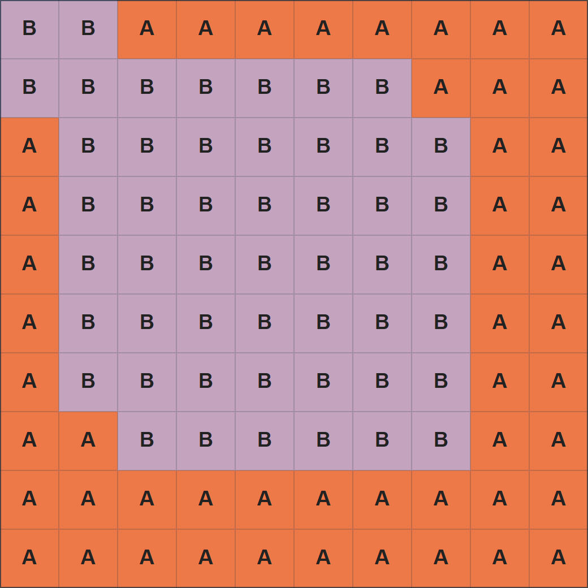

## 이야기

정사각형 격자 모양의 케이크가 있습니다. **ゆかり**와 **あかり**는 케이크를 같은 크기로 둘로 나누고, 각자 옆면에 크림을 더 발라 먹으려고 합니다.

둘 다 옆면에 바를 크림을 $1$팩씩 쓰기로 했지만, **あかり**는 몰래 $2$팩을 쓰고 싶어졌습니다.

그러나 보통처럼 둘로 나누면 발린 크림의 밀도가 달라 크림 양이 다르다는 사실이 들통납니다. 케이크를 같은 크기로 둘로 나누면서 옆면의 넓이 비율은 $1:2$가 되도록 자르는 방법을 알려 주세요.

## 문제 설명

$2N\times 2N$ 정사각형 격자를 격자선을 따라 **연결된** 두 도형 $A,B$로 나누되, 다음 조건을 모두 만족하는 방법을 하나 출력하세요. 불가능하면 $-1$을 출력하세요.

- $A$와 $B$에 포함된 칸 수가 같습니다.
- $A$의 둘레는 $B$의 둘레의 정확히 $2$배입니다.

도형이 **연결되었다**는 것은 그 도형에 속하는 임의의 두 칸 사이를, 그 도형의 칸만 상하좌우로 따라가며 이동할 수 있다는 뜻입니다.

도형의 **둘레**는 그 도형에 속하는 칸의 변 중, 도형에 속하지 않는 칸이나 격자 바깥과 맞닿은 변의 **개수**입니다.

$A$나 $B$에 구멍이 있어도 됩니다. 이때 둘레는 안쪽 둘레와 바깥쪽 둘레의 합입니다.

## 입력

표준 입력으로 다음 형식의 입력이 주어집니다.

```text
$N$
```

## 제한

- $N$은 정수입니다.
- $1\leq N\leq 500$

## 출력

조건을 만족하는 분할이 있으면 다음 형식으로 하나를 출력하세요. $S_i$는 길이 $2N$의 문자열이며, $j$번째 문자는 위에서 $i$번째 행, 왼쪽에서 $j$번째 열의 칸이 $A$에 속하면 `A`, $B$에 속하면 `B`입니다. 조건을 만족하는 분할이 없으면 $-1$을 출력하세요.

```text
$S_1$
$S_2$
$\vdots$
$S_{2N}$
```

$A$나 $B$에 구멍이 있어도 되지만, 연결되어 있어야 한다는 점에 주의하세요.

마지막에 줄바꿈을 출력하세요.

### 시각화 도구

출력 결과를 확인할 수 있는 [웹 시각화 도구](https://contest.d1y3nqydzefx1p.amplifyapp.com/H/index.html)가 제공됩니다.

대회 중에는 시각화 결과를 공유하거나 풀이·고찰을 언급하는 것이 금지됩니다. 주의하세요.

시각화 도구의 사양에 관한 질문은 원칙적으로 받지 않습니다. 보조 도구로만 사용하세요.

## 예제

### 예제 1 {file=""}

#### 입력

```text
5
```

#### 출력

```text
BBAAAAAAAA
BBBBBBBAAA
ABBBBBBBAA
ABBBBBBBAA
ABBBBBBBAA
ABBBBBBBAA
ABBBBBBBAA
AABBBBBBAA
AAAAAAAAAA
AAAAAAAAAA
```

분할의 한 예는 다음 그림과 같습니다. $A$와 $B$의 칸 수는 각각 $50$개로 같으며, $A$의 둘레는 $64$, $B$의 둘레는 $32$입니다.



### 예제 2 {file=""}

#### 입력

```text
1
```

#### 출력

```text
-1
```

$2\times 2$ 격자를 어떻게 나누어도 조건을 만족하지 않습니다.
