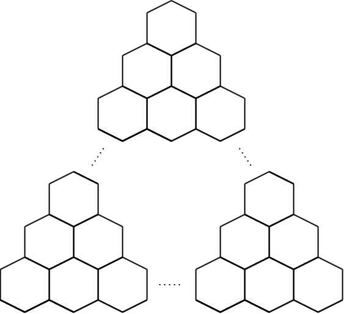
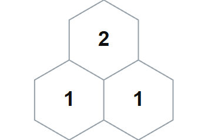

## 문제 설명

그림처럼 정육각형을 배치해 삼각형 모양의 격자를 만들었습니다. 총 $N$단이며, $1\leq i\leq N$에 대해 $i$번째 단에는 정육각형이 $i$개 있습니다.



모든 정육각형에 양의 정수를 적어, 서로 다른 임의의 세 정육각형 $A,B,C$에 대해 다음 조건을 만족시킬 수 있을까요?

- $A$와 $B$, $B$와 $C$, $C$와 $A$가 각각 변을 공유하면, $A,B,C$에 적힌 양의 정수를 각각 $a,b,c$라고 할 때 이 중 어떤 두 수의 합이 나머지 한 수와 같습니다.

그러한 방법이 있으면 적힌 양의 정수의 합이 최소가 되는 방법을 하나 구하세요. 없으면 $-1$을 출력하세요.

## 입력

표준 입력으로 다음 형식의 입력이 주어집니다.

```text
$N$
```

## 제한

- $N$은 정수입니다.
- $2\leq N\leq 500$

## 출력

조건을 만족하는 방법이 있으면 다음 형식으로 하나를 출력하세요. $H_{i,j}$는 $i$번째 단의 왼쪽에서 $j$번째 정육각형에 적는 정수입니다. 조건을 만족하는 방법이 없으면 $-1$을 출력하세요.

```text
$H_{1, 1}$
$H_{2, 1}\ H_{2, 2}$
$H_{3, 1}\ H_{3, 2}\ H_{3, 3}$
$\vdots$
$H_{N, 1}\ H_{N, 2}\ \ldots\ H_{N, N}$
```

마지막에 줄바꿈을 출력하세요.

### 시각화 도구

출력 결과를 확인할 수 있는 [웹 시각화 도구](https://contest.d1y3nqydzefx1p.amplifyapp.com/I/index.html)가 제공됩니다.

대회 중에는 시각화 결과를 공유하거나 풀이·고찰을 언급하는 것이 금지됩니다. 주의하세요.

시각화 도구의 사양에 관한 질문은 원칙적으로 받지 않습니다. 보조 도구로만 사용하세요.

## 예제

### 예제 1 {file=""}

#### 입력

```text
2
```

#### 출력

```text
2
1 1
```

$1+1=2$가 성립합니다. 적힌 양의 정수의 합은 $4$이며, 이것이 최솟값입니다.


