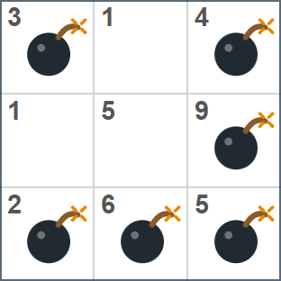

## 문제 설명

길이 $N$의 문자열 $N$개 $S_1,S_2,\ldots,S_N$이 주어집니다. $S_i$는 `0`, `1`, `2`, `3`, `4`, `5`, `6`, `7`, `8`, `9`로만 이루어져 있으며, $j$번째 문자가 나타내는 정수를 $A_{i,j}$라고 합니다.

$N\times N$ 격자가 있고, 위에서 $i$번째 행, 왼쪽에서 $j$번째 열의 칸을 $(i,j)$라고 합니다. 처음에는 아무것도 놓여 있지 않습니다.

각 칸에 폭탄을 $0$개 또는 $1$개 놓을 수 있습니다. 폭탄을 하나도 놓지 않아도 됩니다.

칸 $(i,j)$를 중심으로 하는 $3\times 3$ 영역의 폭탄 수를 $B_{i,j}$라고 할 때, 모든 $1\leq i,j\leq N$에 대해 다음 조건을 만족하는 배치를 하나 구하세요.

- $(i,j)$에 폭탄이 없으면 $B_{i,j}\geq A_{i,j}$, 폭탄이 있으면 $B_{i,j}\leq A_{i,j}$입니다.

이 영역은 $\lvert x-i\rvert\leq 1$과 $\lvert y-j\rvert\leq 1$을 만족하는 칸 $(x,y)$ 중 격자 안에 있는 칸 전체입니다. 격자 바깥은 포함하지 않으며, $(i,j)$ 자체는 포함한다는 점에 주의하세요.

그러한 배치가 없으면 $-1$을 출력하세요.

## 입력

표준 입력으로 다음 형식의 입력이 주어집니다.

```text
$N$
$S_1$
$S_2$
$\vdots$
$S_N$
```

## 제한

- $N$은 정수입니다.
- $1\leq N\leq 1\,000$
- $S_i$는 `0`, `1`, `2`, `3`, `4`, `5`, `6`, `7`, `8`, `9`로만 이루어진 길이 $N$의 문자열입니다.

## 출력

조건을 만족하는 배치가 없으면 $-1$을, 있으면 다음 형식으로 하나를 출력하세요. $T_i$는 길이 $N$의 문자열이며, $j$번째 문자는 위에서 $i$번째 행, 왼쪽에서 $j$번째 열의 칸에 폭탄을 놓으면 `o`, 놓지 않으면 `.`입니다.

```text
$T_1$
$T_2$
$\vdots$
$T_N$
```

마지막에 줄바꿈을 출력하세요.

### 시각화 도구

출력 결과를 확인할 수 있는 [웹 시각화 도구](https://contest.d1y3nqydzefx1p.amplifyapp.com/J/index.html)가 제공됩니다.

대회 중에는 시각화 결과를 공유하거나 풀이·고찰을 언급하는 것이 금지됩니다. 주의하세요.

시각화 도구의 사양에 관한 질문은 원칙적으로 받지 않습니다. 보조 도구로만 사용하세요.

## 예제

### 예제 1 {file=""}

#### 입력

```text
3
314
159
265
```

#### 출력

```text
o.o
..o
ooo
```

폭탄이 있는 칸 $(1,1)$을 중심으로 하는 $3\times 3$ 영역의 폭탄 수는 $1$개이므로 $B_{1,1}=1\leq 3=A_{1,1}$입니다.

폭탄이 없는 칸 $(1,2)$를 중심으로 하는 $3\times 3$ 영역의 폭탄 수는 $3$개이므로 $B_{1,2}=3\geq 1=A_{1,2}$입니다.

다른 칸도 모두 조건을 만족합니다.



### 예제 2 {file=""}

#### 입력

```text
2
00
00
```

#### 출력

```text
..
..
```

폭탄을 하나도 놓지 않아도 됩니다.
