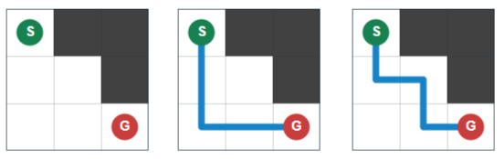

## 문제 설명

각 칸이 흰색 또는 검은색인 $N\times N$ 격자 중 다음 조건을 모두 만족하는 격자를 하나 출력하세요. 격자의 크기 $N$은 입력으로 주어지지 않으며 자유롭게 정할 수 있습니다.

- **$2\leq N\leq 2^{10}$**
- 칸 $(1,1)$과 $(N,N)$은 흰색입니다.
- 각 $1\leq i\leq \lvert S\rvert$에 대해 문자열 $S$의 $i$번째 문자가 `o`이면, $(1,1)$에서 $(N,N)$까지 오른쪽 또는 아래쪽으로 인접한 흰 칸으로 이동하기를 반복하는 경로 중 정확히 $i$번 꺾는 경로가 존재합니다.
- 각 $1\leq i\leq \lvert S\rvert$에 대해 문자열 $S$의 $i$번째 문자가 `x`이면, 위와 같은 경로 중 정확히 $i$번 꺾는 경로가 존재하지 않습니다.

$\lvert S\rvert$는 문자열 $S$의 길이입니다. 경로가 $i$번 꺾는다는 것은 첫 이동을 제외한 이동 중, 직전 이동과 방향(오른쪽 또는 아래쪽)이 다른 이동이 정확히 $i$번이라는 뜻입니다.

$\lvert S\rvert$번보다 많이 꺾는 경로는 존재해도 되고 없어도 됩니다.

조건을 만족하는 격자가 없으면 $-1$을 출력하세요.

## 입력

표준 입력으로 다음 형식의 입력이 주어집니다.

```text
$S$
```

## 제한

- $S$는 `o`와 `x`로 이루어진 문자열입니다.
- $1\leq \lvert S\rvert\leq 1\,000$

## 출력

조건을 만족하는 격자가 있으면 다음 형식으로 하나를 출력하세요. $T_i$ $(1\leq i\leq N)$는 길이 $N$의 문자열이며, $j$번째 문자는 위에서 $i$번째 행, 왼쪽에서 $j$번째 열의 칸이 흰색이면 `.`, 검은색이면 `#`여야 합니다.

```text
$N$
$T_1$
$T_2$
$\vdots$
$T_N$
```

조건을 만족하는 격자가 없으면 $-1$을 출력하세요. 마지막에 줄바꿈을 출력하세요.

### 시각화 도구

출력 결과를 확인할 수 있는 [웹 시각화 도구](https://contest.d1y3nqydzefx1p.amplifyapp.com/K/index.html)가 제공됩니다.

대회 중에는 시각화 결과를 공유하거나 풀이·고찰을 언급하는 것이 금지됩니다. 주의하세요.

시각화 도구의 사양에 관한 질문은 원칙적으로 받지 않습니다. 보조 도구로만 사용하세요.

## 예제

### 예제 1 {file=""}

#### 입력

```text
oxo
```

#### 출력

```text
3
.##
..#
...
```

$1$번 꺾는 경로의 예는 $(1,1)\rightarrow(2,1)\rightarrow(3,1)\rightarrow(3,2)\rightarrow(3,3)$입니다.

$2$번 꺾는 경로는 없습니다.

$3$번 꺾는 경로의 예는 $(1,1)\rightarrow(2,1)\rightarrow(2,2)\rightarrow(3,2)\rightarrow(3,3)$입니다.


