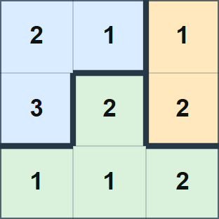

## 문제 설명

kencho군은 수 $N$과 격자를 아주 좋아합니다.

kencho군의 집에는 정사각형 작은 방들이 $N$행 $N$열로 배치되어 있습니다. 위에서 $i$번째 행, 왼쪽에서 $j$번째 열의 작은 방에는 가구가 $A_{i,j}$개 있습니다.

처음에는 이 집에 만족했지만, 방의 수와 각 방의 가구 수를 좋아하는 수 $N$과 관련되게 만들고 싶어졌습니다. 그래서 인접한 작은 방 사이의 벽 일부를 허물어 작은 방들을 합치기로 했습니다. 원래의 작은 방은 나누지 않으며 각각 정확히 하나의 방에 속합니다.

kencho군은 다음 조건을 모두 만족하는 구조를 만들려고 합니다.

- 방이 정확히 $N$개입니다.
- 각 방은 하나 이상의 작은 방으로 이루어지며 연결되어 있습니다.
- 각 방의 가구 수 합은 $N$의 배수입니다.

방이 연결되어 있다는 것은 같은 방에 속하는 임의의 두 작은 방 사이를, 같은 방에 속하는 작은 방만 상하좌우로 따라가며 이동할 수 있다는 뜻입니다.

가구는 모두 바닥에 단단히 붙어 있어 옮길 수 없습니다.

조건을 만족하는 구조를 kencho군에게 알려 주세요. 그러한 구조가 없으면 $-1$을 출력하세요.

테스트 케이스가 $T$개 주어집니다. 각각 답을 출력하세요.

## 입력

표준 입력으로 다음 형식의 입력이 주어집니다. $case_i$는 $i$번째 테스트 케이스입니다.

```text
$T$
$case_1$
$case_2$
$\vdots$
$case_T$
```

각 테스트 케이스는 다음 형식으로 주어집니다.

```text
$N$
$A_{1,1}\ A_{1,2}\ \ldots\ A_{1,N}$
$A_{2,1}\ A_{2,2}\ \ldots\ A_{2,N}$
$\vdots$
$A_{N,1}\ A_{N,2}\ \ldots\ A_{N,N}$
```

## 제한

- 입력으로 주어지는 모든 수는 정수입니다.
- $1\leq T\leq 10^5$
- $2\leq N\leq 1\,000$
- $1\leq A_{i,j}\leq N$
- 한 입력 파일에서 $N^2$의 합은 $10^6$ 이하입니다.

## 출력

각 테스트 케이스에 대해 조건을 만족하는 구조가 있으면 다음 형식으로 하나를 출력하세요.

만든 방 $N$개에 $1$부터 $N$까지 서로 다른 번호를 붙이세요. $B_{i,j}$는 위에서 $i$번째 행, 왼쪽에서 $j$번째 열의 작은 방이 속하는 방의 번호입니다.

$1\leq B_{i,j}\leq N$이어야 하며 각 방은 연결되어 있어야 합니다. 또한 $1$ 이상 $N$ 이하의 모든 정수 $k$에 대해 $B_{i,j}=k$인 $(i,j)$가 하나 이상 있어야 합니다. 예제 $1$도 참고하세요.

```text
$B_{1, 1}\ B_{1, 2}\ \ldots\ B_{1, N}$
$B_{2, 1}\ B_{2, 2}\ \ldots\ B_{2, N}$
$\vdots$
$B_{N, 1}\ B_{N, 2}\ \ldots\ B_{N, N}$
```

조건을 만족하는 구조가 없으면 $-1$을 출력하세요. 각 테스트 케이스의 출력 마지막에 줄바꿈을 출력하세요.

### 시각화 도구

출력 결과를 확인할 수 있는 [웹 시각화 도구](https://contest.d1y3nqydzefx1p.amplifyapp.com/L/index.html)가 제공됩니다.

대회 중에는 시각화 결과를 공유하거나 풀이·고찰을 언급하는 것이 금지됩니다. 주의하세요.

시각화 도구의 사양에 관한 질문은 원칙적으로 받지 않습니다. 보조 도구로만 사용하세요.

## 예제

### 예제 1 {file=""}

#### 입력

```text
2
3
2 1 1
3 2 2
1 1 2
2
1 2
1 1
```

#### 출력

```text
1 1 2
1 3 2
3 3 3
-1
```

첫 번째 테스트 케이스를 설명합니다.

새 구조에서 방 $1$의 가구는 $6$개, 방 $2$는 $3$개, 방 $3$은 $6$개입니다. 모두 $3$의 배수이므로 정답입니다.

방의 구분과 가구 배치는 다음 그림과 같습니다.



다음 출력은 방 $1$이 여러 곳으로 나뉘어 연결되어 있지 않으므로 오답입니다.

#### 출력

```text
1 3 3
2 1 3
1 1 3
```

다음 출력은 방 $2$에 속하는 영역이 없어 방이 정확히 $N$개라는 조건을 어기므로 오답입니다.

#### 출력

```text
1 3 3
1 1 3
1 1 3
```
