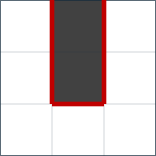

## 이야기

이 문제는 2023년 3월에 만들었으며, 제가 처음으로 만든 격자 구성 문제입니다.

출제하면서 난이도와 형식을 조정했지만 풀이법은 거의 그대로입니다.

## 문제 설명

$H$행 $W$열의 격자가 있습니다. 각 칸을 흰색 또는 검은색으로 칠해 다음 세 조건을 만족시킬 수 있을까요?

- 모든 흰 칸이 연결되어 있습니다. 즉, 임의의 흰 칸 $x$에서 흰 칸 $y$까지 상하좌우로 인접한 흰 칸만 지나서 이동할 수 있습니다.
- 모든 검은 칸이 연결되어 있습니다. 즉, 임의의 검은 칸 $x$에서 검은 칸 $y$까지 상하좌우로 인접한 검은 칸만 지나서 이동할 수 있습니다.
- 흰 칸과 검은 칸이 상하좌우로 인접한 곳이 정확히 $K$곳입니다.

가능하면 그러한 격자를 하나 출력하고, 불가능하면 이를 보고하세요.

## 입력

표준 입력으로 다음 형식의 입력이 주어집니다.

```text
$H\ W\ K$
```

## 제한

- 입력으로 주어지는 모든 수는 정수입니다.
- $1\leq H\leq 1\,000$
- $1\leq W\leq 1\,000$
- $2\leq HW$
- $0\leq K\leq 2HW-H-W$

## 출력

조건을 만족하는 격자가 있으면 하나를 출력하고, 없으면 $-1$을 출력하세요.

격자는 다음 형식으로 출력하세요. $S_i$의 $j$번째 문자는 $i$번째 행, $j$번째 열의 칸이 검은색이면 `#`, 흰색이면 `.`입니다. 예제 $1$도 참고하세요.

```text
$S_1$
$S_2$
$\vdots$
$S_H$
```

마지막에 줄바꿈을 출력하세요.

### 시각화 도구

출력 결과를 확인할 수 있는 [웹 시각화 도구](https://contest.d1y3nqydzefx1p.amplifyapp.com/M/index.html)가 제공됩니다.

대회 중에는 시각화 결과를 공유하거나 풀이·고찰을 언급하는 것이 금지됩니다. 주의하세요.

시각화 도구의 사양에 관한 질문은 원칙적으로 받지 않습니다. 보조 도구로만 사용하세요.

## 예제

### 예제 1 {file=""}

#### 입력

```text
3 3 5
```

#### 출력

```text
.#.
.#.
...
```

흰 칸과 검은 칸이 각각 모두 연결되어 있으며, 흰 칸과 검은 칸이 상하좌우로 인접한 곳이 $5$곳이므로 조건을 만족합니다.



### 예제 2 {file=""}

#### 입력

```text
2 2 1
```

#### 출력

```text
-1
```

### 예제 3 {file=""}

#### 입력

```text
3 4 0
```

#### 출력

```text
####
####
####
```

모든 칸이 검은색이어도 모든 흰 칸이 연결되어 있다고 간주한다는 점에 주의하세요.
