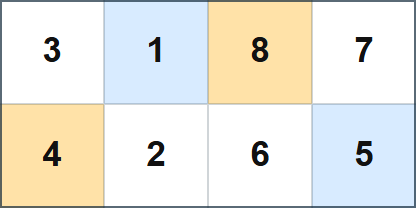
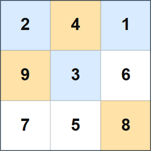

## 문제 설명

$H\times W$ 격자의 각 칸에 다음 두 조건을 만족하도록 정수를 적습니다.

- 각 칸에는 정확히 하나의 정수가 적혀 있습니다.
- $1$ 이상 $HW$ 이하의 각 정수는 정확히 한 칸에 적혀 있습니다.

즉, $1$ 이상 $HW$ 이하의 정수 $HW$개와 칸 $HW$개가 일대일로 대응하도록 적습니다.

어떤 칸의 정수가 상하좌우로 인접한 모든 칸의 정수보다 크면 그 칸을 봉우리 칸이라고 합니다. 반대로 상하좌우로 인접한 모든 칸의 정수보다 작으면 골짜기 칸이라고 합니다.

봉우리 칸과 골짜기 칸이 각각 정확히 $M$개가 되도록 적는 방법을 하나 구하세요. 그러한 방법이 없으면 $-1$을 출력하세요.

## 입력

표준 입력으로 다음 형식의 입력이 주어집니다.

```text
$H\ W\ M$
```

## 제한

- 입력으로 주어지는 모든 수는 정수입니다.
- $1\leq H,W\leq 500$
- $2\leq HW$
- $0\leq 2M\leq HW$

### 부분 점수

이 문제에는 서브태스크에 따른 부분 점수가 있습니다.

| 서브태스크 | 배점 | 제한 |
| --- | --- | --- |
| 부분 점수 | $20$% ($70$점) | $H,W$는 짝수입니다. |
| 만점 | $80$% ($280$점) | 추가 제한이 없습니다. |

## 출력

조건을 만족하는 방법이 있으면 다음 형식으로 하나를 출력하세요. $A_{i,j}$는 위에서 $i$번째 행, 왼쪽에서 $j$번째 열의 칸에 적는 정수입니다. 조건을 만족하는 방법이 없으면 $-1$을 출력하세요.

```text
$A_{1, 1}\ A_{1, 2}\ \ldots\ A_{1, W}$
$A_{2, 1}\ A_{2, 2}\ \ldots\ A_{2, W}$
$\vdots$
$A_{H, 1}\ A_{H, 2}\ \ldots\ A_{H, W}$
```

마지막에 줄바꿈을 출력하세요.

### 시각화 도구

출력 결과를 확인할 수 있는 [웹 시각화 도구](https://contest.d1y3nqydzefx1p.amplifyapp.com/N/index.html)가 제공됩니다.

대회 중에는 시각화 결과를 공유하거나 풀이·고찰을 언급하는 것이 금지됩니다. 주의하세요.

시각화 도구의 사양에 관한 질문은 원칙적으로 받지 않습니다. 보조 도구로만 사용하세요.

## 예제

### 예제 1 {file=""}

#### 입력

```text
2 4 2
```

#### 출력

```text
3 1 8 7
4 2 6 5
```

출력 예는 다음 그림과 같습니다. $4,8$이 적힌 두 칸이 봉우리 칸이고, $1,5$가 적힌 두 칸이 골짜기 칸입니다.

이 테스트 케이스는 부분 점수 케이스에 포함됩니다.



### 예제 2 {file=""}

#### 입력

```text
3 3 3
```

#### 출력

```text
2 4 1
9 3 6
7 5 8
```

출력 예는 다음 그림과 같습니다. $4,9,8$이 적힌 세 칸이 봉우리 칸이고, $2,1,3$이 적힌 세 칸이 골짜기 칸입니다.

이 테스트 케이스는 부분 점수 케이스에 포함되지 않습니다.



### 예제 3 {file=""}

#### 입력

```text
2 1 0
```

#### 출력

```text
-1
```
