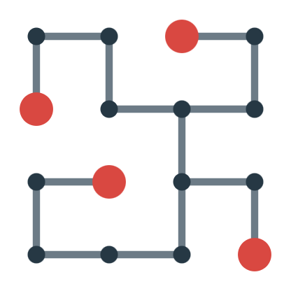

## 이야기

Permutation Tree를 알고 있나요? 알고 있는 사람도 모르는 사람도 이 문제에서는 동등합니다.

## 문제 설명

정점이 $N$행 $N$열로 배치된 격자 그래프 $G$가 있습니다. $1\leq i,j\leq N$에 대해 위에서 $i$번째 행, 왼쪽에서 $j$번째 열의 정점 번호는 $(i-1)N+j$입니다.

다음 조건을 모두 만족하는 $G$의 스패닝 트리 $T$를 하나 구하세요. $T$의 리프는 $T$에서 차수가 $1$인 정점입니다.

- 각 $1\leq i\leq N$에 대해 위에서 $i$번째 행의 정점 중 정확히 하나가 $T$의 리프입니다.
- 각 $1\leq j\leq N$에 대해 왼쪽에서 $j$번째 열의 정점 중 정확히 하나가 $T$의 리프입니다.

조건을 만족하는 $T$가 없으면 $-1$을 출력하세요.

## 입력

표준 입력으로 다음 형식의 입력이 주어집니다.

```text
$N$
```

## 제한

- $N$은 정수입니다.
- $2\leq N\leq 500$

## 출력

$T$의 간선을 다음 형식으로 출력하세요. $s_i,t_i$는 $i$번째 간선이 연결하는 두 정점의 번호입니다.

```text
$s_1\ t_1$
$s_2\ t_2$
$\vdots$
$s_{N^2-1}\ t_{N^2-1}$
```

조건을 만족하는 $T$가 없으면 $-1$을 출력하세요. 마지막에 줄바꿈을 출력하세요.

### 시각화 도구

출력 결과를 확인할 수 있는 [웹 시각화 도구](https://contest.d1y3nqydzefx1p.amplifyapp.com/O/index.html)가 제공됩니다.

대회 중에는 시각화 결과를 공유하거나 풀이·고찰을 언급하는 것이 금지됩니다. 주의하세요.

시각화 도구의 사양에 관한 질문은 원칙적으로 받지 않습니다. 보조 도구로만 사용하세요.

## 예제

### 예제 1 {file=""}

#### 입력

```text
4
```

#### 출력

```text
1 2
3 4
1 5
2 6
4 8
6 7
7 8
7 11
9 10
11 12
9 13
11 15
12 16
13 14
14 15
```

트리는 다음 그림과 같으며, 정점 $3,5,10,16$이 리프입니다.



### 예제 2 {file=""}

#### 입력

```text
2
```

#### 출력

```text
-1
```

$G$의 스패닝 트리는 $4$가지이지만, 어느 것도 조건을 만족하지 않습니다.
