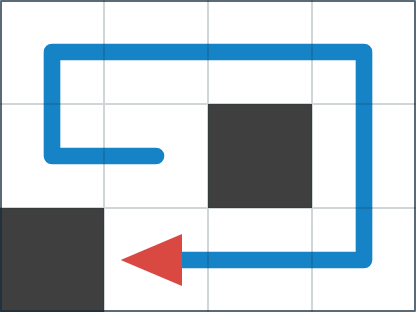

## 문제 설명

바닥 칸과 벽 칸으로 이루어진 $H\times W$ 격자 모양의 미로가 있습니다. 당신은 로봇으로 이 미로를 탐사하려고 합니다.

처음에 바닥 칸 하나를 골라 로봇을 놓고, 상하좌우 중 로봇의 방향도 고를 수 있습니다. 이후 다음 두 명령을 원하는 횟수만큼 내릴 수 있습니다.

- 직진: 바라보는 방향으로 한 칸 이동합니다.
- 우회전: 시계 방향으로 $90$도 회전한 뒤 바라보는 방향으로 한 칸 이동합니다.

어느 명령이든 반드시 한 칸 이동한다는 점에 주의하세요.

목표는 로봇이 **모든 바닥 칸**을 지나게 하는 것입니다. 시작 칸과 마지막 칸도 지난 것으로 간주합니다. 벽 칸에는 들어갈 수 없습니다.

하지만 같은 바닥 칸을 두 번 이상 지나면 바닥이 무너져 로봇이 망가집니다. 벽 칸이나 격자 밖으로 이동해도 로봇이 망가집니다.

로봇을 망가뜨리지 않고 목표를 달성할 수 있을까요? 가능하면 초기 상태와 명령열을 하나 구하고, 불가능하면 $-1$을 출력하세요.

## 입력

표준 입력으로 다음 형식의 입력이 주어집니다.

```text
$H\ W$
$S_1$
$S_2$
$\vdots$
$S_H$
```

$S_i$의 $j$번째 문자가 `.`이면 위에서 $i$번째 행, 왼쪽에서 $j$번째 열은 바닥 칸이고, `#`이면 벽 칸입니다.

## 제한

- $H,W$는 정수입니다.
- $1\leq H,W\leq 2\,000$
- $S_i$는 `.`과 `#`으로만 이루어진 길이 $W$의 문자열입니다.
- 바닥 칸이 하나 이상 있습니다.

### 부분 점수

이 문제에는 서브태스크에 따른 부분 점수가 있습니다.

| 서브태스크 | 배점 | 제한 |
| --- | --- | --- |
| 부분 점수 | $80$% ($320$점) | $1\leq H,W\leq 200$ |
| 만점 | $20$% ($80$점) | 추가 제한이 없습니다. |

## 출력

로봇을 망가뜨리지 않고 목표를 달성하는 초기 상태와 명령열을 다음 형식으로 하나 출력하세요. 없으면 $-1$을 출력하세요.

```text
$r\ c\ d$
$t$
$X$
```

- $r$은 시작 칸의 위에서부터 센 행 번호로, $1$ 이상 $H$ 이하의 정수입니다.
- $c$는 시작 칸의 왼쪽에서부터 센 열 번호로, $1$ 이상 $W$ 이하의 정수입니다.
- $d$는 시작 방향을 나타내는 문자입니다. `U`는 위, `R`은 오른쪽, `D`는 아래, `L`은 왼쪽입니다.
- $t$는 명령 횟수로, $0$ 이상 $HW-1$ 이하의 정수입니다.
- $X$는 명령열을 나타내는 길이 $t$의 문자열입니다. $i$번째 명령이 직진이면 $i$번째 문자는 `F`, 우회전이면 `R`입니다.

마지막에 줄바꿈을 출력하세요.

### 시각화 도구

출력 결과를 확인할 수 있는 [웹 시각화 도구](https://contest.d1y3nqydzefx1p.amplifyapp.com/R/index.html)가 제공됩니다.

대회 중에는 시각화 결과를 공유하거나 풀이·고찰을 언급하는 것이 금지됩니다. 주의하세요.

시각화 도구의 사양에 관한 질문은 원칙적으로 받지 않습니다. 보조 도구로만 사용하세요.

## 예제

### 예제 1 {file=""}

#### 입력

```text
3 4
....
..#.
#...
```

#### 출력

```text
2 2 L
9
FRRFFRFRF
```

위에서 $i$번째 행, 왼쪽에서 $j$번째 열을 $(i,j)$라고 합시다. 로봇은 처음에 $(2,2)$에서 왼쪽을 바라보며, 다음 경로로 모든 바닥 칸을 지납니다.

$(2,2)\rightarrow(2,1)\rightarrow(1,1)\rightarrow(1,2)\rightarrow(1,3)\rightarrow(1,4)\rightarrow(2,4)\rightarrow(3,4)\rightarrow(3,3)\rightarrow(3,2)$



### 예제 2 {file=""}

#### 입력

```text
2 3
#..
..#
```

#### 출력

```text
-1
```

로봇은 좌회전할 수 없습니다.
