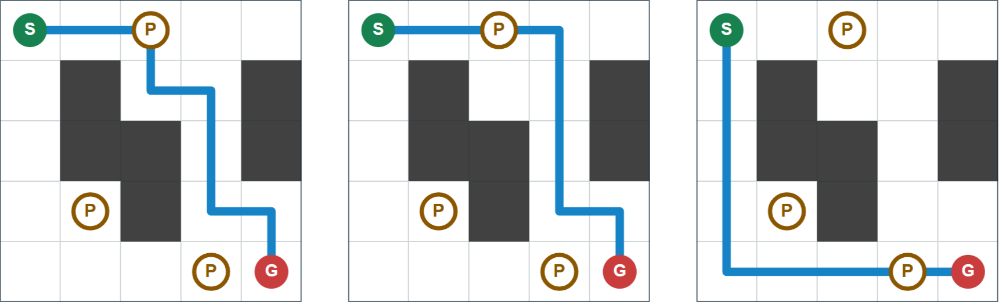

## 문제 설명

당신은 퍼즐 게임을 개발하면서 적당한 난이도의 스테이지를 만들려고 합니다.

스테이지는 정사각형 격자이며 통로, 벽, 스위치의 세 종류 칸으로 이루어집니다. 플레이어는 통로와 스위치 칸을 이동할 수 있지만 벽 칸에는 들어갈 수 없습니다.

스테이지를 $N$행 $N$열 격자라고 하고, 위에서 $i$번째 행, 왼쪽에서 $j$번째 열의 칸을 $(i,j)$라고 합시다. 다음 조건을 모두 만족하는 스테이지를 만들 수 있을까요? $N$은 입력으로 주어지지 않으며 자유롭게 정할 수 있습니다.

- **$2\leq N\leq 40$**
- $(1,1)$과 $(N,N)$은 통로 칸입니다.
- 오른쪽 또는 아래쪽의 인접한 칸으로 이동하기를 반복해 $(1,1)$에서 $(N,N)$으로 가는 경로 중, 스위치 칸을 정확히 한 번 지나는 경로가 정확히 $M$개입니다.

가능하면 스테이지를 하나 출력하고, 불가능하면 $-1$을 출력하세요.

테스트 케이스가 $T$개 주어집니다. 각각 답을 출력하세요.

## 입력

표준 입력으로 다음 형식의 입력이 주어집니다. $case_i$는 $i$번째 테스트 케이스입니다.

```text
$T$
$case_1$
$case_2$
$\vdots$
$case_T$
```

각 테스트 케이스는 다음 형식으로 주어집니다.

```text
$M$
```

## 제한

- 입력으로 주어지는 모든 수는 정수입니다.
- $1\leq T\leq 100$
- $1\leq M\leq 10^{18}$

### 부분 점수

이 문제에는 서브태스크에 따른 부분 점수가 있습니다.

| 서브태스크 | 배점 | 제한 |
| --- | --- | --- |
| 부분 점수 $1$ | $20$% ($80$점) | $M\leq 10^9$ |
| 부분 점수 $2$ | $30$% ($120$점) | $M\leq 10^{15}$ |
| 만점 | $50$% ($200$점) | 추가 제한이 없습니다. |

## 출력

각 테스트 케이스에 대해 조건을 만족하는 스테이지가 없으면 $-1$을, 있으면 다음 형식으로 하나를 출력하세요. $S_i$ $(1\leq i\leq N)$는 길이 $N$의 문자열입니다. $j$번째 문자는 위에서 $i$번째 행, 왼쪽에서 $j$번째 열의 칸이 통로이면 `.`, 벽이면 `#`, 스위치이면 `P`여야 합니다.

```text
$N$
$S_1$
$S_2$
$\vdots$
$S_N$
```

각 테스트 케이스의 출력 마지막에 줄바꿈을 출력하세요.

### 시각화 도구

출력 결과를 확인할 수 있는 [웹 시각화 도구](https://contest.d1y3nqydzefx1p.amplifyapp.com/T/index.html)가 제공됩니다.

대회 중에는 시각화 결과를 공유하거나 풀이·고찰을 언급하는 것이 금지됩니다. 주의하세요.

시각화 도구의 사양에 관한 질문은 원칙적으로 받지 않습니다. 보조 도구로만 사용하세요.

## 예제

### 예제 1 {file=""}

#### 입력

```text
1
3
```

#### 출력

```text
5
..P..
.#..#
.##.#
.P#..
...P.
```

스위치 칸을 정확히 한 번 지나는 경로는 $3$개입니다.


