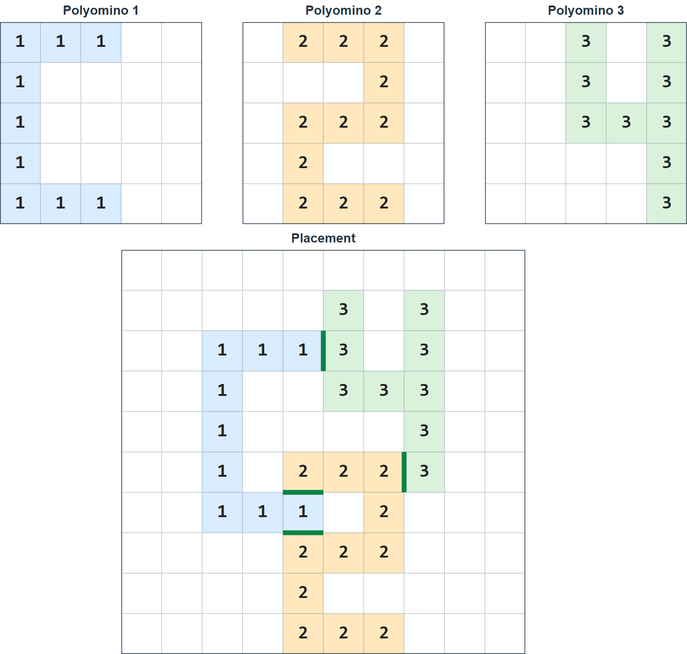
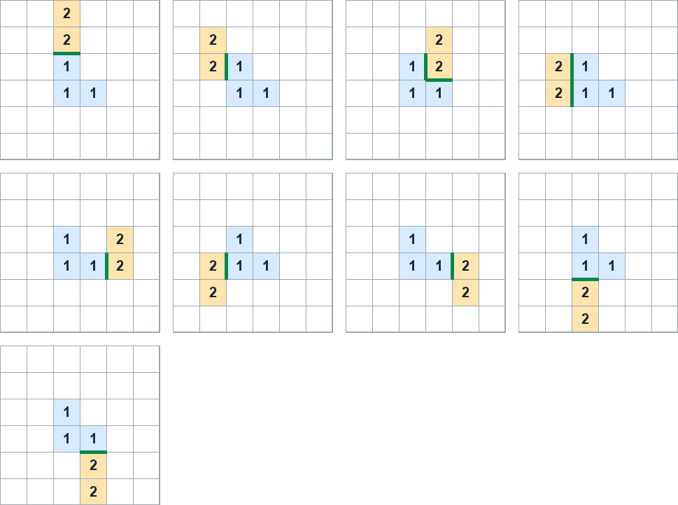
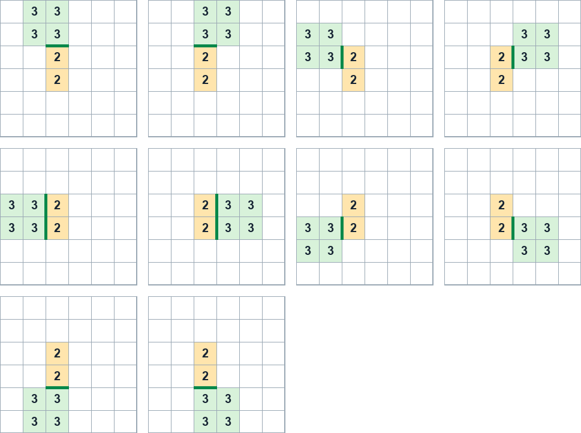
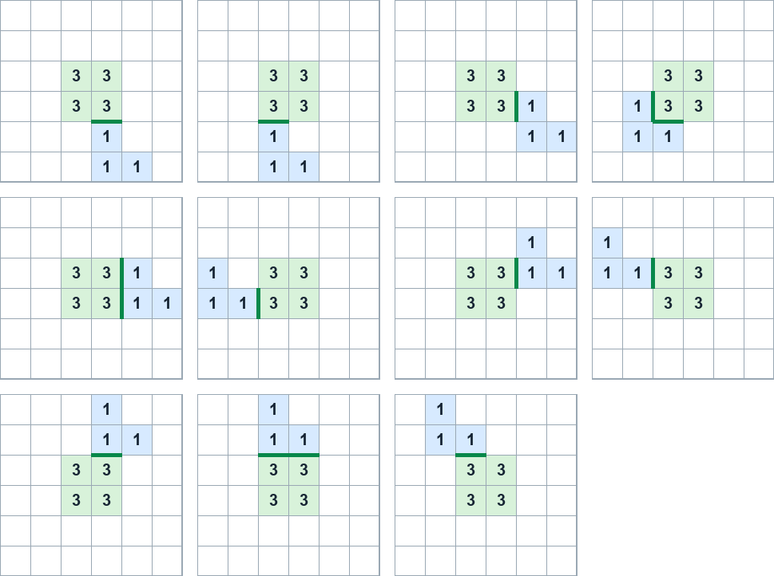
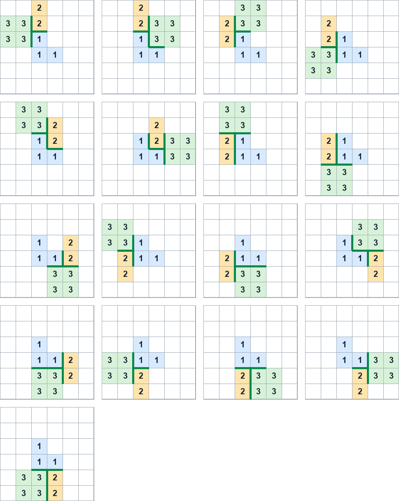

## 이야기

kencho군은 다음 문제를 생각했습니다.

> $N\times N$ 격자에 들어가는 폴리오미노 $3$개가 주어집니다. 각 폴리오미노를 평행 이동해, 어느 두 폴리오미노도 겹치지 않고 변을 공유하며 인접하게 하는 방법을 하나 출력하세요.



얼핏 재미있어 보였지만, 단순한 탐색에 가까운 풀이를 SIMD로 가속하면 의도한 풀이보다 빨라진다는 사실을 알게 되었습니다. 시간이 있다면 $O(N^2\log N)$ 풀이를 생각해 보세요.

그래서 kencho군은 출제 형식을 바꾸어, 폴리오미노들을 무작위로 인접하게 배치하며 조건을 만족하는 조합을 찾는 잘못된 풀이를 틀리게 만드는 테스트 케이스를 만들도록 하기로 했습니다.

참고로 polyominal이라는 말은 논문 등에서 쓰인 사례가 조금 있지만 거의 사용하지 않으며, 보통 polyomino를 그대로 명사 수식에 사용한다고 합니다.

## 문제 설명

각 칸에 `#` 또는 `.`이 적힌 $N\times N$ 격자를 생각합니다. 격자 $G$에서 `#`인 칸을 단위 정사각형으로 볼 때 그 집합을 **$G$가 나타내는 도형**이라고 합니다.

도형이 비어 있지 않고, 변을 공유하는 단위 정사각형을 따라 임의의 단위 정사각형에서 다른 모든 단위 정사각형으로 이동할 수 있으면 **폴리오미노**라고 합니다.

다음 조건을 모두 만족하는 정수 $N$과 $N\times N$ 격자 세 개 $(G_1,G_2,G_3)$를 구하세요. $G_i$가 나타내는 도형을 $P_i$라고 합니다.

- $N$은 $1$ 이상 $666$ 이하의 정수입니다.
- $i=1,2,3$에 대해 $P_i$는 폴리오미노입니다.
- 평행 이동으로 $P_1$과 $P_2$를 인접하게 하는 방법은 $10^5$가지 이상입니다.
- 평행 이동으로 $P_2$와 $P_3$를 인접하게 하는 방법은 $10^5$가지 이상입니다.
- 평행 이동으로 $P_3$와 $P_1$을 인접하게 하는 방법은 $10^5$가지 이상입니다.
- 평행 이동으로 $P_1$과 $P_2$, $P_2$와 $P_3$, $P_3$와 $P_1$을 동시에 인접하게 하는 방법은 $1$가지 이상 $10$가지 이하입니다.

### 인접하게 하는 방법의 수

이 문제에서는 폴리오미노를 회전하거나 뒤집지 않고 정수 벡터만큼만 평행 이동합니다. 이동은 무한한 정사각 격자 위에서 이루어지며, 이동 후 도형이 원래의 $N\times N$ 격자 안에 들어갈 필요는 없습니다.

두 폴리오미노가 다음 조건을 모두 만족하면 **인접한다**고 합니다.

- 두 폴리오미노의 단위 정사각형이 겹치지 않습니다.
- 한 폴리오미노의 단위 정사각형과 다른 폴리오미노의 단위 정사각형 중 변을 공유하는 쌍이 있습니다. 꼭짓점만 공유하면 인접한 것으로 보지 않습니다.

$P_i$와 $P_j$를 인접하게 하는 방법의 수는 $P_i$를 고정하고 $P_j$를 정수 벡터만큼 평행 이동할 때, 두 폴리오미노가 인접하게 되는 평행 이동 벡터의 개수입니다. 공유하는 변이 여러 개여도 이동 벡터가 같으면 한 가지입니다.

세 쌍을 동시에 인접하게 하는 방법의 수는 $P_1$을 고정하고 $P_2,P_3$를 각각 정수 벡터 $v_2,v_3$만큼 평행 이동할 때, 세 쌍이 모두 인접하게 되는 순서쌍 $(v_2,v_3)$의 개수입니다.

따라서 모든 폴리오미노를 같은 만큼 평행 이동한 배치는 별개의 방법으로 세지 않습니다.

## 입력

이 문제는 **출력 전용(output-only)** 문제입니다. 입력은 주어지지 않습니다.

## 출력

다음 형식으로 정수 $N$과 격자 $G_1,G_2,G_3$를 출력하세요.

```text
$N$
$G_{1, 1, 1} G_{1, 1, 2} \ldots G_{1, 1, N}$
$G_{1, 2, 1} G_{1, 2, 2} \ldots G_{1, 2, N}$
$\vdots$
$G_{1, N, 1} G_{1, N, 2} \ldots G_{1, N, N}$
$G_{2, 1, 1} G_{2, 1, 2} \ldots G_{2, 1, N}$
$G_{2, 2, 1} G_{2, 2, 2} \ldots G_{2, 2, N}$
$\vdots$
$G_{2, N, 1} G_{2, N, 2} \ldots G_{2, N, N}$
$G_{3, 1, 1} G_{3, 1, 2} \ldots G_{3, 1, N}$
$G_{3, 2, 1} G_{3, 2, 2} \ldots G_{3, 2, N}$
$\vdots$
$G_{3, N, 1} G_{3, N, 2} \ldots G_{3, N, N}$
```

$G_{i,j,k}$는 격자 $G_i$의 위에서 $j$번째 행, 왼쪽에서 $k$번째 열의 문자입니다.

마지막에 줄바꿈을 출력하세요.

### 시각화 도구

출력 결과를 확인할 수 있는 [웹 시각화 도구](https://contest.d1y3nqydzefx1p.amplifyapp.com/U/index.html)가 제공됩니다.

대회 중에는 시각화 결과를 공유하거나 풀이·고찰을 언급하는 것이 금지됩니다. 주의하세요.

시각화 도구의 사양에 관한 질문은 원칙적으로 받지 않습니다. 보조 도구로만 사용하세요.

## 예제

### 예제 1 {file=""}

#### 출력

```text
2
#.
##
.#
.#
##
##
```

**이 출력 예는 출력 형식만 보여 주며, 제출하면 `WA`로 판정된다는 점에 주의하세요.**

이 출력이 나타내는 $P_1,P_2,P_3$에서 각 방법의 수는 다음과 같습니다.

평행 이동으로 $P_1$과 $P_2$를 인접하게 하는 방법은 $9$가지입니다.



평행 이동으로 $P_2$와 $P_3$를 인접하게 하는 방법은 $10$가지입니다.



평행 이동으로 $P_3$와 $P_1$을 인접하게 하는 방법은 $11$가지입니다.



평행 이동으로 $P_1$과 $P_2$, $P_2$와 $P_3$, $P_3$와 $P_1$을 동시에 인접하게 하는 방법은 $17$가지입니다.


