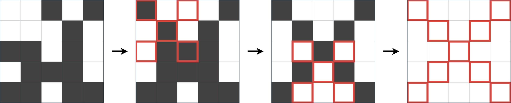

## 문제 설명

$N\times N$ 정사각형 격자가 있습니다. 처음에 각 칸은 흰색 또는 검은색입니다.

다음 연산을 $0$번 이상 $5\times 10^5$번 이하로 하여 모든 칸을 흰색으로 만들 수 있을까요? 가능하면 연산열을 하나 출력하고, 불가능하면 $-1$을 출력하세요.

- 한 변의 칸 수가 $3$ 이상의 홀수인 정사각형 부분 격자를 골라, 두 대각선 위의 모든 칸의 색을 반전합니다. 엄밀히 말해 $k\geq 1$, $k+1\leq r\leq N-k$, $k+1\leq c\leq N-k$를 모두 만족하는 정수 세 개 $(k,r,c)$를 고르고, 정수 $i$ $(-k\leq i\leq k)$를 사용해 $(r+i,c+i)$ 또는 $(r+i,c-i)$로 나타낼 수 있는 $4k+1$개 칸의 색을 반전합니다.

## 입력

표준 입력으로 다음 형식의 입력이 주어집니다.

```text
$N$
$S_1$
$S_2$
$\vdots$
$S_N$
```

$S_i$의 $j$번째 문자가 `.`이면 위에서 $i$번째 행, 왼쪽에서 $j$번째 열의 칸은 흰색이고, `#`이면 검은색입니다.

## 제한

- $N$은 정수입니다.
- $3\leq N\leq 500$
- $S_i$는 `.`과 `#`으로만 이루어진 길이 $N$의 문자열입니다.

## 출력

연산열을 다음 형식으로 하나 출력하세요.

```text
$T$
$k_1\ r_1\ c_1$
$k_2\ r_2\ c_2$
$\vdots$
$k_T\ r_T\ c_T$
```

$T$는 연산열의 길이로, $0$ 이상 $5\times 10^5$ 이하의 정수입니다. $k_i,r_i,c_i$는 $i$번째 연산에서 고른 $k,r,c$입니다.

조건을 만족하는 연산열이 없으면 $-1$을 출력하세요. 마지막에 줄바꿈을 출력하세요.

### 시각화 도구

출력 결과를 확인할 수 있는 [웹 시각화 도구](https://contest.d1y3nqydzefx1p.amplifyapp.com/V/index.html)가 제공됩니다.

대회 중에는 시각화 결과를 공유하거나 풀이·고찰을 언급하는 것이 금지됩니다. 주의하세요.

시각화 도구의 사양에 관한 질문은 원칙적으로 받지 않습니다. 보조 도구로만 사용하세요.

## 예제

### 예제 1 {file=""}

#### 입력

```text
5
..#.#
...#.
##.#.
.###.
##.##
```

#### 출력

```text
3
1 2 2
1 4 3
2 3 3
```

격자는 다음 그림처럼 바뀝니다.



### 예제 2 {file=""}

#### 입력

```text
3
.#.
..#
.#.
```

#### 출력

```text
-1
```

격자 밖으로 벗어나는 연산은 할 수 없다는 점에 주의하세요.

### 예제 3 {file=""}

#### 입력

```text
15
...............
.....#####.....
...#########...
.#############.
#..#########..#
###..#####..###
#####..#..#####
#..####.#######
###..##.#######
#######.#######
#######.#######
#######.#######
.######.######.
...####.####...
.....##.##.....
```

#### 출력

```text
66
1 12 6
1 13 11
1 5 2
1 14 4
1 6 9
1 14 13
1 11 2
3 8 11
1 6 13
2 6 3
1 4 11
1 5 8
2 3 5
4 11 10
4 9 11
1 10 4
1 10 13
1 3 6
2 4 3
1 4 6
2 8 3
1 8 5
1 12 2
1 12 8
2 3 9
2 4 6
1 14 11
4 6 5
1 11 11
3 12 4
5 8 6
3 7 8
1 11 7
1 10 6
2 8 4
1 9 9
1 11 14
1 12 3
1 2 2
1 14 10
1 11 4
1 5 5
1 3 11
2 9 4
1 7 8
1 10 5
4 11 7
1 12 14
1 9 10
1 11 13
1 5 12
1 12 4
2 7 4
1 8 14
1 7 12
3 4 12
1 6 14
1 7 14
2 13 3
1 9 6
1 7 3
2 9 3
2 3 13
2 7 3
4 5 5
2 12 7
```

입력 격자는 다음과 같습니다.


