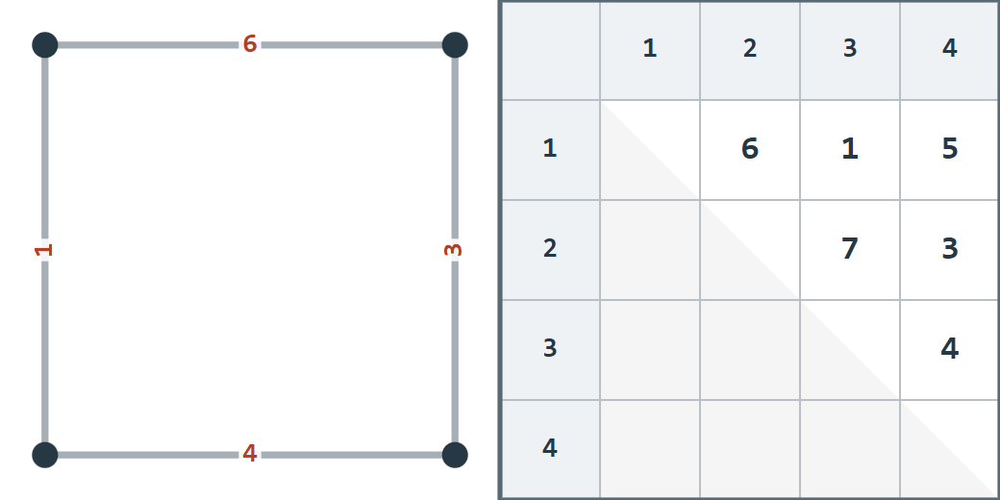

## 이야기

삿포로에서 아바시리까지의 이동 거리와 오사카에서 히로시마까지의 이동 거리는 거의 같습니다. 이견이 있을 수 있습니다.

kencho군은 격자 그래프 위에서 드라이브하고 싶어졌습니다. 매일 달리고 싶은 거리를 정한 뒤 조건에 맞는 출발점과 도착점 쌍을 찾아 달리기로 했지만, 그런 쌍이 여러 개이면 어디를 달릴지 고민하게 된다는 사실을 깨달았습니다. kencho군은 내비게이션을 쓰므로 항상 최단 경로로 달립니다.

kencho군이 고민하지 않아도 되는 격자 그래프를 만들어 주세요.

## 문제 설명

정점이 $N$행 $N$열로 배치된 무방향 격자 그래프 $G$가 있습니다. $1\leq i,j\leq N$에 대해 위에서 $i$번째 행, 왼쪽에서 $j$번째 열의 정점 번호는 $(i-1)N+j$입니다.

각 간선의 가중치를 $1$ 이상 $3\times 10^5$ 이하의 정수로 정할 수 있습니다.

경로의 길이는 경로에 포함된 간선 가중치의 합이며, 두 정점 사이의 최단 거리는 두 정점을 연결하는 경로 길이의 최솟값입니다.

서로 다른 두 정점의 순서를 구별하지 않는 쌍은 총 $\frac{N^2(N^2-1)}{2}$개입니다. 이 모든 쌍의 최단 거리가 서로 다르도록 각 간선의 가중치를 정하세요.

엄밀히 말해 $1\leq i\lt j\leq N^2$에 대해 정점 $i,j$ 사이의 최단 거리를 $d_{i,j}$라고 할 때, $(i_1,j_1)\neq(i_2,j_2)\Rightarrow d_{i_1,j_1}\neq d_{i_2,j_2}$가 성립해야 합니다.

같은 두 정점을 연결하는 최단 경로는 여러 개 있어도 됩니다.

조건을 만족하는 방법이 없으면 $-1$을 출력하세요.

## 입력

표준 입력으로 다음 형식의 입력이 주어집니다.

```text
$N$
```

## 제한

- $N$은 정수입니다.
- $2\leq N\leq 50$

### 부분 점수

이 문제에는 서브태스크에 따른 부분 점수가 있습니다.

| 서브태스크 | 배점 | 제한 |
| --- | --- | --- |
| 부분 점수 $1$ | $10$% ($50$점) | $N\leq 5$ |
| 부분 점수 $2$ | $10$% ($50$점) | $N\leq 10$ |
| 부분 점수 $3$ | $10$% ($50$점) | $N\leq 15$ |
| 부분 점수 $4$ | $10$% ($50$점) | $N\leq 20$ |
| 부분 점수 $5$ | $10$% ($50$점) | $N\leq 25$ |
| 부분 점수 $6$ | $10$% ($50$점) | $N\leq 30$ |
| 부분 점수 $7$ | $10$% ($50$점) | $N\leq 35$ |
| 부분 점수 $8$ | $10$% ($50$점) | $N\leq 40$ |
| 부분 점수 $9$ | $10$% ($50$점) | $N\leq 45$ |
| 만점 | $10$% ($50$점) | 추가 제한이 없습니다. |

## 출력

각 간선의 가중치를 다음 형식으로 출력하세요. $v_{i,j}$는 정점 $(i-1)N+j$와 $iN+j$를 연결하는 세로 간선의 가중치이고, $h_{i,j}$는 정점 $(i-1)N+j$와 $(i-1)N+j+1$을 연결하는 가로 간선의 가중치입니다.

```text
$v_{1,1}\ v_{1,2}\ \ldots\ v_{1,N}$
$v_{2,1}\ v_{2,2}\ \ldots\ v_{2,N}$
$\vdots$
$v_{N-1,1}\ v_{N-1,2}\ \ldots\ v_{N-1,N}$
$h_{1,1}\ h_{1,2}\ \ldots\ h_{1,N-1}$
$h_{2,1}\ h_{2,2}\ \ldots\ h_{2,N-1}$
$\vdots$
$h_{N,1}\ h_{N,2}\ \ldots\ h_{N,N-1}$
```

조건을 만족하는 방법이 없으면 $-1$을 출력하세요. 마지막에 줄바꿈을 출력하세요.

### 시각화 도구

출력 결과를 확인할 수 있는 [웹 시각화 도구](https://contest.d1y3nqydzefx1p.amplifyapp.com/W/index.html)가 제공됩니다.

대회 중에는 시각화 결과를 공유하거나 풀이·고찰을 언급하는 것이 금지됩니다. 주의하세요.

시각화 도구의 사양에 관한 질문은 원칙적으로 받지 않습니다. 보조 도구로만 사용하세요.

## 예제

### 예제 1 {file=""}

#### 입력

```text
2
```

#### 출력

```text
1 3
6
4
```

각 정점 쌍의 최단 거리는 다음과 같으며 모두 다릅니다.

- 정점 $1$과 $2$: $6$
- 정점 $1$과 $3$: $1$
- 정점 $1$과 $4$: $5$
- 정점 $2$와 $3$: $7$
- 정점 $2$와 $4$: $3$
- 정점 $3$과 $4$: $4$


