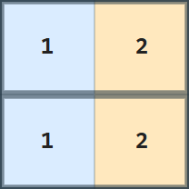
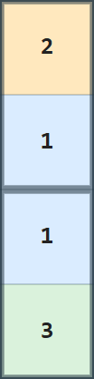

## 문제 설명

$H\times W$ 직사각형 격자를 $1\times 2$ 또는 $2\times 1$ 크기의 색칠된 직사각형 타일로 빈틈없이 채워 색칠된 격자를 만듭니다. 다음 조건을 모두 만족하면서 사용하는 색의 종류 수가 최소인 배치를 하나 구하세요.

- 모든 타일은 정확히 두 칸을 완전히 덮습니다.
- 타일은 격자 밖으로 나가거나 서로 겹쳐서는 안 됩니다.
- 각 타일의 두 칸은 서로 다른 색입니다.
- 완성된 격자 전체에서 같은 색의 영역은 상하좌우 방향으로 연결되어 있습니다.

같은 색의 영역이 상하좌우 방향으로 연결되어 있다는 것은 같은 색 $c$인 임의의 두 칸 $A,B$ 사이를, 상하좌우로 인접한 색 $c$인 칸만 지나서 이동할 수 있다는 뜻입니다.

제한 내에서는 그러한 배치가 반드시 존재함을 보일 수 있습니다.

## 입력

표준 입력으로 다음 형식의 입력이 주어집니다.

```text
$H\ W$
```

## 제한

- 입력으로 주어지는 모든 수는 정수입니다.
- $1\leq H,W\leq 200$
- **$HW$는 짝수입니다.**

### 부분 점수

이 문제에는 서브태스크에 따른 부분 점수가 있습니다.

| 서브태스크 | 배점 | 제한 |
| --- | --- | --- |
| 부분 점수 | $60$% ($300$점) | $H,W$는 짝수입니다. |
| 만점 | $40$% ($200$점) | 추가 제한이 없습니다. |

## 출력

사용하는 색의 종류 수가 최소인 배치를 다음 형식으로 하나 출력하세요.

```text
$C$
$x_{1, 1}\ y_{1, 1}\ c_{1, 1}\ x_{1, 2}\ y_{1, 2}\ c_{1, 2}$
$x_{2, 1}\ y_{2, 1}\ c_{2, 1}\ x_{2, 2}\ y_{2, 2}\ c_{2, 2}$
$\vdots$
$x_{\frac{HW}{2}, 1}\ y_{\frac{HW}{2}, 1}\ c_{\frac{HW}{2}, 1}\ x_{\frac{HW}{2}, 2}\ y_{\frac{HW}{2}, 2}\ c_{\frac{HW}{2}, 2}$
```

$C$는 사용하는 색의 종류 수입니다. 위에서 $s$번째 행, 왼쪽에서 $t$번째 열의 칸을 $(s,t)$라고 할 때, $i$번째 타일이 덮는 두 칸은 $(x_{i,1},y_{i,1})$, $(x_{i,2},y_{i,2})$이고 각 칸의 색은 $c_{i,1}$, $c_{i,2}$입니다.

$1\leq c_{i,1},c_{i,2}\leq C$여야 하며, $1$ 이상 $C$ 이하의 각 색이 적어도 한 칸에 사용되어야 합니다. 타일의 출력 순서는 자유입니다.

마지막에 줄바꿈을 출력하세요.

### 시각화 도구

출력 결과를 확인할 수 있는 [웹 시각화 도구](https://contest.d1y3nqydzefx1p.amplifyapp.com/X/index.html)가 제공됩니다.

대회 중에는 시각화 결과를 공유하거나 풀이·고찰을 언급하는 것이 금지됩니다. 주의하세요.

시각화 도구의 사양에 관한 질문은 원칙적으로 받지 않습니다. 보조 도구로만 사용하세요.

## 예제

### 예제 1 {file=""}

#### 입력

```text
2 2
```

#### 출력

```text
2
1 1 1 1 2 2
2 2 2 2 1 1
```

출력 예의 배치는 다음과 같습니다.



이 테스트 케이스는 부분 점수 케이스에 포함됩니다.

다음 출력도 배치 조건은 만족하지만 사용한 색의 종류 수가 최소가 아니므로 정답이 아닙니다.

#### 출력

```text
3
1 1 3 1 2 2
2 2 2 2 1 1
```

### 예제 2 {file=""}

#### 입력

```text
4 1
```

#### 출력

```text
3
1 1 2 2 1 1
3 1 1 4 1 3
```

출력 예의 배치는 다음과 같습니다. 같은 색의 영역이 연결되려면 $3$색 이상이 필요합니다.



이 테스트 케이스는 부분 점수 케이스에 포함되지 않습니다.
