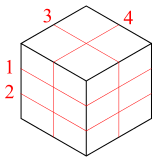

## 문제 설명

정육면체를 몇 장의 평면으로 잘라 합동인 직육면체 $N$개로 나누려고 합니다. 이렇게 나누려면 정육면체를 몇 장의 평면으로 잘라야 할까요? 평면 개수 $T$의 최솟값 $T_{\min}$과 최댓값 $T_{\max}$을 구하세요.

단, 자른 조각을 이동하지 않고 전체가 원래 정육면체의 모양과 위치를 유지한 상태에서 $T$장의 평면으로 자른다고 합니다.

## 입력

```text
$N$
```

$N$은 정수입니다. 정육면체를 합동인 직육면체 $N$개로 나눕니다.

## 제한

$1\lt N\lt10^{11}$

## 출력

```text
$T_{\min}\ T_{\max}$
```

평면 개수의 최솟값 $T_{\min}$과 최댓값 $T_{\max}$를 출력하세요. $2$개의 값 사이에는 공백 $1$개를 넣고, 마지막에 개행하세요.

## 예제

### 예제 1 {file=""}

#### 입력

```text
12
```

#### 출력

```text
4 11
```

아래 그림에서 빨간색으로 나타낸 것처럼 $4$장의 평면으로 잘라 합동인 직육면체 $12$개로 나눌 수 있습니다. 이보다 적은 평면으로는 나눌 수 없으므로 $T_{\min}=4$입니다.



바닥과 평행한 $11$장의 평면으로 잘라 합동인 직육면체 $12$개로 나누는 방법도 가능하며, 이보다 많은 평면으로는 나눌 수 없으므로 $T_{\max}=11$입니다.

### 예제 2 {file=""}

#### 입력

```text
13
```

#### 출력

```text
12 12
```

어떻게 잘라도 $12$장의 평면이 필요하므로 $T_{\min}=T_{\max}=12$입니다.
