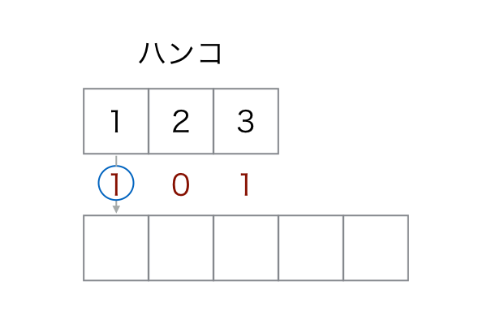
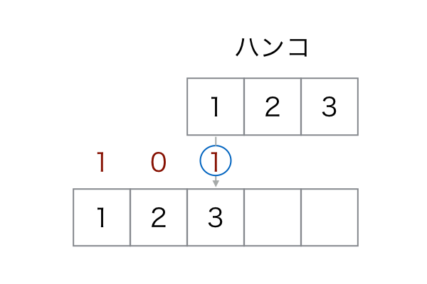
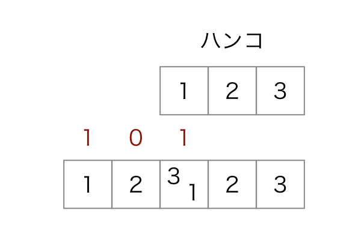

## 문제 설명

MKM君은 길이 $N$인 격자 모양 도장을 가지고 있습니다. 각 칸에는 물감이 묻어 있고 $i$번째 칸의 색은 $a_i$입니다.

또한 길이 $2\times N-1$인 격자 모양 종이를 가지고 있습니다. 처음에는 모든 칸에 물감이 없습니다.

MKM君이 종이에 도장을 찍는 정보가 길이 $N$인 수열 $b_i$로 주어집니다. $b_i$는 $0$ 또는 $1$이며, $1$이면 도장의 왼쪽 끝이 종이의 왼쪽에서 $i$번째 칸과 겹치도록 찍었다는 뜻입니다. 같은 위치에 $2$번 찍지는 않습니다.

각 칸에 어떤 색의 물감이 섞이는지 구하는 것은 어려우므로, 그 개수가 짝수인지 홀수인지만 구하세요. 도장을 찍은 뒤 매번 종이를 말리므로 종이에 묻은 물감이 도장으로 옮겨 가지는 않습니다.

## 입력

```text
$N$
$a_1\ a_2\ \dots\ a_N$
$b_1\ b_2\ \dots\ b_N$
```

입력은 모두 정수입니다.

## 제한

- $1\le N\le100\,000$
- $1\le a_i\le100\,000$
- $b_i$는 $0$ 또는 $1$입니다.

## 출력

총 $2\times N-1$줄을 출력합니다. $i$번째 줄에 $i$번째 칸의 답이 짝수이면 `EVEN`, 홀수이면 `ODD`를 출력하세요.

## 예제

### 예제 1 {file=""}

#### 입력

```text
3
1 2 3
1 0 1
```

#### 출력

```text
ODD
ODD
EVEN
ODD
ODD
```

그림의 ‘ハンコ’는 도장을 뜻합니다.

$b_1$과 $b_3$이 $1$입니다. 앞쪽 위치에 먼저 찍는다고 하면, $1$번째 도장은 아래 그림과 같습니다.



$2$번째 도장은 아래 그림과 같습니다.



결과는 아래 그림과 같습니다.



$1,2,3,4,5$번째 칸의 물감은 각각 $\{1\}$, $\{2\}$, $\{1,3\}$, $\{2\}$, $\{3\}$이므로 $3$번째만 짝수입니다.

### 예제 2 {file=""}

#### 입력

```text
3
1 2 1
1 0 1
```

#### 출력

```text
ODD
ODD
ODD
ODD
ODD
```

$1,2,3,4,5$번째 칸의 물감은 각각 $\{1\}$, $\{2\}$, $\{1\}$, $\{2\}$, $\{1\}$이므로 모든 칸의 물감 개수가 홀수입니다.
