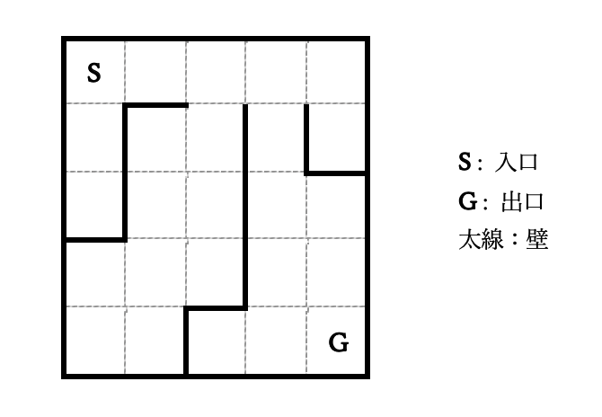

## 이야기

당신은 로봇을 원격 조작하여 어떤 건물의 내부 구조를 조사하려고 합니다. 건물 내부에는 여러 벽이 있어서 통과할 수 없습니다.

로봇이 벽이 있는 방향으로 나아가려고 하면, 로봇은 그곳에 벽이 있다는 사실을 당신에게 알리고 입구까지 되돌아옵니다.

당신의 목적은 건물의 입구에서 출구까지의 경로를 발견하는 것입니다.

단, 이 로봇에는 결함이 있어서 진행 방향에 벽이 없는 경우에도 일정한 확률로 벽이 있다고 판정하는 것으로 밝혀졌습니다.

## 문제 설명

세로 $20$칸, 가로 $20$칸인 격자가 주어집니다. 격자의 바깥 둘레에는 벽이 있으며, 인접한 칸과 칸 사이에도 벽이 있을 수 있습니다.

가장 왼쪽 위 칸의 좌표를 $(0, 0)$이라 하고, 그곳에서 아래로 $i$칸, 오른쪽으로 $j$칸 이동한 칸의 좌표를 $(i, j)$라고 합니다. 이 건물의 입구는 칸 $(0, 0)$에, 출구는 칸 $(19, 19)$에 있습니다.

이동 중 벽을 통과하지 않고 최종 도착 지점이 출구인 경로를 「목적 경로」라고 합니다.

목적 경로를 발견할 때까지 다음 시도를 반복하세요. 각 시도에서 로봇은 입구에서 이동을 시작합니다.

- 위, 아래, 왼쪽, 오른쪽으로의 이동을 각각 `U`, `D`, `L`, `R`로 나타내며, 이동 경로를 길이 $400$ 이하의 문자열로 출력하세요.
- 출력한 이동 경로가 목적 경로라면 저지는 $-1$을 반환합니다. 이 경우 즉시 프로그램을 종료하세요.
- 그렇지 않으면 로봇이 이동할 수 있었던 횟수가 반환됩니다. 단, 각 이동에서 일정한 확률 $p$로 진행 방향에 벽이 없는 경우에도 이동에 실패하여 시도가 종료됩니다.
- $1\,001$번째 시도에서 저지는 $-1$을 반환하므로 즉시 프로그램을 종료하세요.

목적 경로를 출력하면 저지는 **항상** $-1$을 반환한다는 점에 주의하세요.

### 점수

$t$번째 시도에서 목적 경로를 출력하면 $1\,001-t$점을 얻습니다. 단, 시도 횟수가 $1\,001$ 이상이 되면 해당 테스트 케이스의 점수는 $0$점입니다.

출력한 문자열에 `U`, `D`, `L`, `R` 이외의 문자가 포함되면 **WA**로 판정됩니다.

테스트 케이스는 총 $100$개이며, 제출 점수는 각 테스트 케이스 점수의 합입니다.

최종 순위는 대회 시간 중 얻은 최고 점수로 결정되며, 대회 종료 후 시스템 테스트는 진행되지 않습니다. 대회 순위는 위의 「스코어 순」 탭에서 확인할 수 있습니다.

## 입력

입력은 다음 형식으로 표준 입력에서 주어집니다.

```text
$H\ W\ p$
```

$H$는 격자의 행 수, $W$는 격자의 열 수를 나타냅니다.

로봇이 이동에 실패할 확률 $p$는 백분율로 주어집니다.

또한 각 시도에서 문자열을 출력한 뒤, 정수 $1$개가 표준 입력에서 주어집니다.

**저지의 입력을 반드시 마지막까지 모두 받아야 합니다. 그렇게 하지 않으면 `WA`가 될 수 있습니다.**

## 제한

- $H=W=20$
- $6\leq p\leq15$
- $p$는 정수입니다.
- 모든 칸은 입구에서 도달할 수 있습니다.

### 입력 생성 방법

$L$ 이상 $U$ 이하의 정숫값을 균일하게 무작위로 생성하는 함수를 $\operatorname{rand}(L,U)$로 나타냅니다.

$i$번째 테스트 케이스에서 로봇이 이동에 실패할 확률은 $p=6+(i-1)\bmod 10$으로 정합니다.

입력으로 주어지지는 않지만, 벽의 위치는 다음 절차로 결정됩니다. 먼저 바깥 둘레를 제외한 벽의 총 개수 $M=\operatorname{rand}(100,200)$을 정하고, 다음 작업을 $M$번 반복합니다. 단, 벽을 설치했을 때 도달할 수 없는 칸이 생기거나 이미 벽이 설치된 위치를 선택한 경우에는 설치하지 않고 작업을 다시 시도합니다.

벽의 방향을 정하는 난수 $D=\operatorname{rand}(0,1)$을 생성합니다.

- $D=0$이면 $i=\operatorname{rand}(0,19)$, $j=\operatorname{rand}(1,19)$로 정하고, 칸 $(i,j-1)$과 칸 $(i,j)$ 사이에 벽을 설치합니다.
- $D=1$이면 $i=\operatorname{rand}(1,19)$, $j=\operatorname{rand}(0,19)$로 정하고, 칸 $(i-1,j)$과 칸 $(i,j)$ 사이에 벽을 설치합니다.

각 테스트 케이스에서 확률 $p$에 따라 각 시도에서 최대로 이동할 수 있는 횟수가 미리 정해져 있습니다.

다음 작업을 $1\,000$번 반복하여 이동 가능 횟수 $t_i$를 정합니다. $i$번째 작업은 다음과 같습니다.

1. $1$ 이상 $100$ 이하의 정수 $c$를 균일하게 무작위로 생성합니다.
2. $c$를 생성한 횟수가 $400$을 초과하면 $t_i=400$으로 정하고 작업을 종료합니다.
3. $c\leq p$이면 작업을 종료하고, $t_i=(c$를 생성한 횟수$)-1$로 정합니다. 그렇지 않으면 $1$번으로 돌아갑니다.

$i$번째 시도에서는 진행 방향에 벽이 있거나 $t_i+1$번째 이동을 시도하면 이동에 실패합니다.

테스트 케이스 생성 프로그램과 저지 프로그램은 [GitHub](https://github.com/platinum-prog/yukicoder_8096)에서 받을 수 있습니다.

## 출력

각 시도에서 길이 $400$ 이하의 문자열 $1$개를 출력하세요. 출력한 문자열의 길이가 $400$을 초과하면 $401$번째 문자부터는 무시됩니다.

**각 출력 후 표준 출력을 flush하세요. 그렇지 않으면 `TLE`가 될 수 있습니다.**

저지가 $-1$을 반환하기 전에 제출 프로그램이 종료한 경우와, 저지가 $-1$을 반환한 뒤에 출력한 경우의 동작은 정의되지 않습니다.

## 예제

### 예제 1 {file=""}

#### 입력

```text
5 5 10
```

이 예제는 설명을 위해 격자를 작게 만든 것이며, 실제 테스트 케이스에는 포함되지 않습니다.

이 경우 로봇은 각 이동에서 진행 방향에 벽이 없는 경우에도 $0.1$의 확률로 이동에 실패합니다.

이 테스트 케이스의 격자는 다음 그림과 같다고 가정합니다(입력으로 주어지지는 않습니다).



예를 들어 다음과 같은 시도를 생각할 수 있습니다.

#### 출력

```text
DDDDRRRR
```

#### 입력

```text
2
```

#### 출력

```text
RRRRDDDD
```

#### 입력

```text
3
```

#### 출력

```text
RRRDDDDR
```

#### 입력

```text
-1
```

$1$번째 시도에서는 $3$번째 이동에서 진행 방향에 벽이 있어 이동에 실패하여 $2$가 반환되었습니다.

$2$번째 시도에서는 $4$번째 이동에서 진행 방향에 벽이 없었지만 로봇의 결함으로 이동에 실패하여 $3$이 반환되었습니다.

$3$번째 시도에서는 목적 경로를 출력했으므로 $-1$이 반환되었습니다. 이 테스트 케이스에서는 $998$점을 얻습니다.
