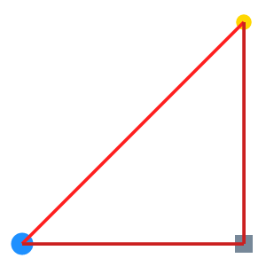
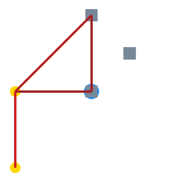

실행 시간 제한은 **$1$초**입니다. 주의하세요.

## 이야기

천체 관측 기술의 발전으로 미지의 행성이 다수 발견되었습니다. 이에 새로 개발된 무인 탐사선을 이용하여 이 행성들을 모두 조사하게 되었습니다.

행성 사이를 이동할 때는 거리의 제곱에 비례하는 에너지를 소비합니다. 중계 지점이 되는 우주 정거장을 적절한 장소에 배치하여, 가능한 한 에너지 소비량이 적은 조사 경로를 정해 주세요.

## 문제 설명

행성의 좌표가 $N$개 주어집니다. 각 행성은 $2$차원 평면 위에 존재하며, $i$번째 행성의 좌표는 $(a_i,b_i)$입니다.

또한 우주 정거장이 $M$개 있습니다. $j$번째 우주 정거장은 $0 \leq c_j \leq 1\,000$, $0 \leq d_j \leq 1\,000$을 만족하는 임의의 정수 좌표 $(c_j,d_j)$에 배치할 수 있습니다.

$1$번 배치한 우주 정거장을 다시 다른 좌표로 옮길 수는 없습니다.

행성과 우주 정거장을 합쳐 ‘경유지’라고 부릅니다. 방문하는 경유지의 수를 $V$, $k$번째로 방문하는 경유지의 좌표를 $(x_k,y_k)$라고 하겠습니다.

$k$번째 경유지에서 $k+1$번째 경유지로 이동할 때 소비하는 에너지 $E_k$ ($1 \leq k \leq V-1$)를, 경유지 사이의 유클리드 거리 $D_k=\sqrt{(x_k-x_{k+1})^2+(y_k-y_{k+1})^2}$와 상수 $\alpha$ ($1 \leq \alpha$)를 사용하여 다음과 같이 정합니다.

- $k$번째 경유지와 $k+1$번째 경유지가 모두 행성인 경우: $E_k=\alpha^2D_k^2$
- $k$번째 경유지와 $k+1$번째 경유지 중 정확히 $1$개만 행성인 경우: $E_k=\alpha D_k^2$
- $k$번째 경유지와 $k+1$번째 경유지가 모두 우주 정거장인 경우: $E_k=D_k^2$

어느 경우든 소비 에너지가 **유클리드 거리의 제곱에 비례**한다는 점에 주의하세요.

각 우주 정거장을 배치한 뒤, 행성 $1$에서 출발하여 모든 행성을 $1$번 이상 방문하고 다시 행성 $1$로 돌아오는 경로 중 소비 에너지의 총합 $\sum_{k=1}^{V-1}E_k$가 가능한 한 작은 경로를 구하세요.

같은 경유지를 여러 번 방문해도 되며, 방문하지 않는 우주 정거장이 있어도 됩니다. 배치한 우주 정거장의 좌표가 다른 경유지의 좌표와 같아도 됩니다.

## 입력

입력은 다음 형식으로 표준 입력에서 주어집니다.

```text
$N\ M$
$a_1\ b_1$
$\vdots$
$a_N\ b_N$
```

## 제한

모든 테스트 케이스에서 $\alpha=5$로 고정됩니다.

- $N=100$
- $M=8$
- $0 \leq a_i \leq 1\,000$
- $0 \leq b_i \leq 1\,000$
- $i \neq i'$이면 $(a_i,b_i) \neq (a_{i'},b_{i'})$
- 입력은 모두 정수입니다.

## 출력

다음 형식으로 표준 출력에 출력하고, 마지막에 개행 문자를 출력하세요.

```text
$c_1\ d_1$
$\vdots$
$c_M\ d_M$
$V$
$t_1\ r_1$
$\vdots$
$t_V\ r_V$
```

$t_k$는 $k$번째 경유지의 종류를 나타내는 정수입니다. 행성인 경우 $1$, 우주 정거장인 경우 $2$입니다.

$r_k$는 $k$번째 경유지의 번호입니다. 행성인 경우 $1 \leq r_k \leq N$, 우주 정거장인 경우 $1 \leq r_k \leq M$입니다.

각 변수는 다음 제한을 만족해야 합니다.

- $0 \leq c_j \leq 1\,000$
- $0 \leq d_j \leq 1\,000$
- $1 \leq V \leq 10^5$
- $t_k \in \{1,2\}$
- $t_k=1$일 때 $1 \leq r_k \leq N$
- $t_k=2$일 때 $1 \leq r_k \leq M$
- $t_1=t_V=1$
- $r_1=r_V=1$
- 출력은 모두 정수입니다.

## 입력 생성 방법

이 항목은 문제를 이해하는 데 필수적이지 않습니다.

$L$ 이상 $U$ 이하의 정숫값을 균일하게 생성하는 함수를 $\mathrm{rand}(L,U)$로 나타냅니다.

$l=1,2,\cdots,15$에 대하여 다음 절차로 기준점 $(u_l,v_l)$을 생성합니다.

1. $u_l=\mathrm{rand}(100,900)$, $v_l=\mathrm{rand}(100,900)$으로 정합니다. 단, 이미 생성한 기준점 중 $(u_l,v_l)$과의 유클리드 거리가 $100$ 이하인 점이 있으면 $u_l,v_l$의 생성을 다시 시도합니다.

$i=1,2,\cdots,N$에 대하여 다음 절차로 $i$번째 행성의 좌표 $(x_i,y_i)$를 생성합니다.

1. $m_i=\mathrm{rand}(1,15)$를 생성합니다.
2. $\Delta x_i=\mathrm{rand}(-100,100)$, $\Delta y_i=\mathrm{rand}(-100,100)$으로 정하고 $x_i=u_{m_i}+\Delta x_i$, $y_i=v_{m_i}+\Delta y_i$로 합니다. 단, $(x_i,y_i)$가 이미 생성된 행성의 좌표와 같으면 $m_i,\Delta x_i,\Delta y_i$의 생성을 다시 시도합니다.

## 도구 (입력 생성기·비주얼라이저)

- [웹 버전](https://steiner-space-travel.terry-u16.net/)
  - 테스트 케이스 생성 기능, 점수 계산·시각화 기능, Twitter 이미지 공유 기능이 있습니다.
  - 대회 기간 중에는 `seed=0`의 결과에 한하여 Twitter에서 이미지 공유가 허용됩니다. [공유된 이미지 목록](https://twitter.com/search?q=%23SteinerSpaceTravel%20%23visualizer)
  - 공유된 이미지에는 약간의 스포일러가 포함될 수 있습니다. 스포일러를 완전히 피하고 싶다면 각자 `#SteinerSpaceTravel`을 음소거하세요.
- [로컬 버전](https://heuristicstorage.blob.core.windows.net/tools-host/steiner-space-travel.zip)
  - 테스트 케이스 생성 기능, 점수 계산·시각화 기능, **여러 케이스 병렬 실행·집계 기능**이 있습니다.
  - 사용하려면 [.NET Runtime 6](https://dotnet.microsoft.com/ja-jp/download/dotnet/6.0)이 필요합니다. 함께 제공되는 `README.md`를 참고하세요.

## 점수

소비 에너지의 총합이 $S$일 때, $\mathrm{round}(10^9/(1\,000+\sqrt{S}))$점을 얻습니다.

단, 출력이 부적절하면 `WA`로 판정됩니다. 부적절한 출력은 다음과 같습니다.

- 출력 형식이 올바르지 않은 출력
- 변수의 값이 제한을 만족하지 않는 출력
- 경로의 시작점이 행성 $1$이 아닌 출력
- 경로의 끝점이 행성 $1$이 아닌 출력
- 방문하지 않은 행성이 존재하는 출력

테스트 케이스는 총 $30$개이며, 모든 테스트 케이스의 점수 합이 제출 점수가 됩니다.

대회 시간 중 얻은 최고 점수로 최종 순위가 결정되며, 대회 종료 후 시스템 테스트는 진행되지 않습니다.

## 예제

### 예제 1 {file=""}

#### 입력

```text
2 1
0 0
200 200
```

#### 출력

```text
200 0
4
1 1
1 2
2 1
1 1
```

이 케이스는 $N=100$, $M=8$의 제한을 만족하지 않으므로 실제 테스트 케이스로 주어지지 않습니다.

이 케이스를 그림으로 나타내면 다음과 같습니다.

파란색 큰 원은 행성 $1$을, 노란색 원은 다른 행성을, 회색 정사각형은 우주 정거장을 나타냅니다.



초기 상태에서 행성 $1$은 $(0,0)$에, 행성 $2$는 $(200,200)$에 있습니다.

우주 정거장 $1$을 $(200,0)$에 배치하고, 행성 $1$ → 행성 $2$ → 우주 정거장 $1$ → 행성 $1$의 순서로 방문합니다.

각 이동에 필요한 에너지는 다음과 같습니다.

- 행성 $1$ → 행성 $2$: $5^2\times(200^2+200^2)=2\times10^6$
- 행성 $2$ → 우주 정거장 $1$: $5\times(0^2+200^2)=2\times10^5$
- 우주 정거장 $1$ → 행성 $1$: $5\times(200^2+0^2)=2\times10^5$

이때 점수는 $\mathrm{round}(10^9/(10^3+\sqrt{2\times10^6+2\times10^5+2\times10^5}))=392\,281$점입니다.

### 예제 2 {file=""}

#### 입력

```text
3 4
100 100
0 0
0 100
```

#### 출력

```text
150 150
100 100
150 150
100 200
8
1 1
2 4
2 4
1 3
1 2
1 3
2 2
1 1
```

이 케이스는 $N=100$, $M=8$의 제한을 만족하지 않으므로 실제 테스트 케이스로 주어지지 않습니다.

이 케이스를 그림으로 나타내면 다음과 같습니다.



다음 조건은 어느 것도 부적절한 출력에 해당하지 않습니다.

- 행성과 같은 좌표에 우주 정거장을 배치하는 것
- 여러 우주 정거장을 같은 좌표에 배치하는 것
- 경유지 $k$와 경유지 $k+1$이 같은 것
- 같은 경유지를 여러 번 방문하는 것
- 방문하지 않는 우주 정거장이 존재하는 것

따라서 이 출력은 유효하며, $544\,467$점을 얻습니다.
