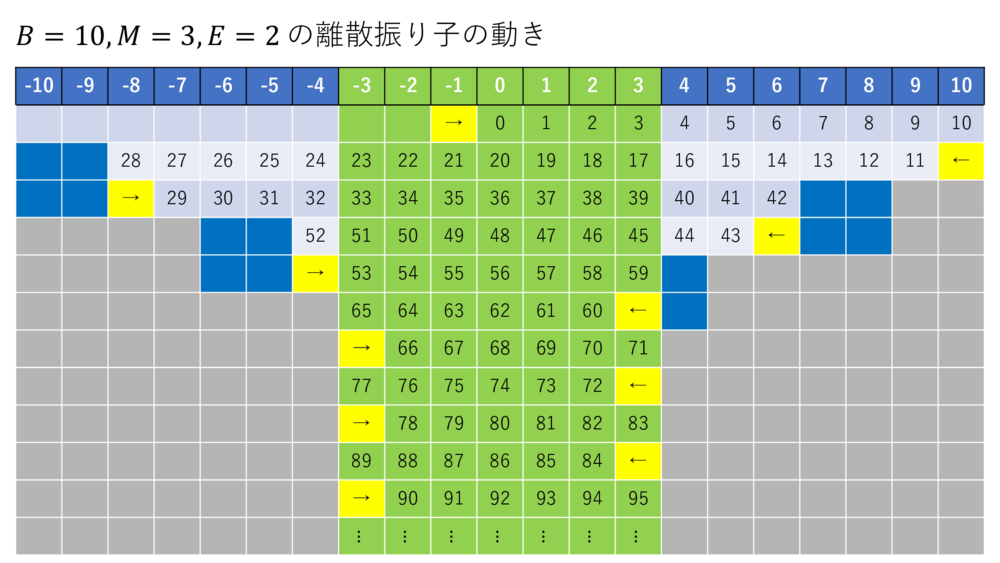

**문제에 관한 규칙과 주의 사항**

이 문제에서 제출한 답안이 CE 이외의 판정을 받은 경우, 그 시점부터 $5$분 동안은 이 문제에 대한 제출을 받을 수 없습니다.

점수 순위는 위 탭의 「점수 순」 또는 [순위표](https://yukicoder.me/problems/8272/score)에서 확인할 수 있습니다.

대회 시간 중에 이 문제의 풀이 또는 답안을 공개해서는 안 됩니다. **이 대회의 종료 시각은 2022/10/15 01:20 (JST)입니다.**

비주얼라이저는 없습니다. 대회 종료 후 리저지나 시스템 테스트는 예정되어 있지 않습니다.

대회 시간 중 제출된 답안 중 최고 점수를 점수로 하며, 점수 내림차순으로 순위를 정합니다.

> **대회에 관한 규칙과 주의 사항**
>
> 이 문제는 yukicoder contest 364 (Do you know Cherry Contest?)에 포함된 문제입니다. 시간 배분에 주의하세요.
>
> 이 문제의 획득 점수는 다음과 같이 정합니다.
>
> - 미제출 또는 스코어가 $0$점이면 $0$점입니다.
> - 스코어가 $1$점 이상이면, 스코어가 $1$점 이상인 사람 중 순위가 $R$위일 때 $\left(100+\left\lfloor 800\exp\left(-\dfrac{R-1}{25}\right)\right\rfloor\right)$점을 얻습니다.
>
> 순위와 점수의 조합 예시는 다음과 같습니다.
>
> | 순위 | $1$ | $2$ | $3$ | $4$ | $5$ | $10$ | $15$ | $20$ | $25$ | $30$ | $35$ | $40$ | $45$ | $50$ | $60$ | $70$ | $80$ | $90$ | $100$ | $125$ | $150$ | $200$ | $\cdots$ |
> | --- | --- | --- | --- | --- | --- | --- | --- | --- | --- | --- | --- | --- | --- | --- | --- | --- | --- | --- | --- | --- | --- | --- |
> | 점수 | $900$ | $868$ | $838$ | $809$ | $781$ | $658$ | $556$ | $474$ | $406$ | $350$ | $305$ | $268$ | $237$ | $212$ | $175$ | $150$ | $133$ | $122$ | $115$ | $105$ | $102$ | $100$ | $\cdots$ |

## 이야기

이산 모델로 표현한 단진자를 생각합니다.

몇 개의 시각이 주어집니다. 이 시각에 이산 진자의 추들이 가능한 한 "좌우로 나뉘어 있는" 상태와 가능한 한 "한곳에 모여 있는" 상태가 되도록 이산 진자를 만들어 주세요.

단, 공기 저항을 모델에 포함했기 때문에 시간이 지날수록 추의 진폭이 작아지는 점에 주의하세요.

## 문제 설명

아래 그림과 같은 $N$개의 이산 진자(이 문제에서만 사용하는 조어) $P_1,\dots,P_N$이 있습니다. 각 $P_i$는 좌표축과 $1$개의 추로 이루어집니다.

각 $P_i$에 대해 초기 진폭 $B_i$, 최소 진폭 $M_i$, 감쇠 진폭 $E_i$를 다음 조건을 만족하는 범위에서 자유롭게 설정할 수 있습니다.

- $B_i$, $M_i$, $E_i$는 정수입니다.
- $1\leq M_i\leq B_i\leq10^9$
- $1\leq E_i\leq10^9$

각 이산 진자 $P_i$는 다음과 같이 움직입니다.

- 시각 $0$에는 추의 좌표가 $0$입니다.
- 시각 $0$의 진폭 $A_i$를 $B_i$로 설정하고, 방향을 나타내는 정수 $D_i$를 $1$로 설정합니다.
- 시각 $0.5,1.5,2.5,\dots,n-0.5\ (n$은 양의 정수$),\dots$에 다음 동작이 일어납니다. 추가 좌표 $x$에 있을 때 좌표 $y:=x+D_i$로 이동합니다. $y=D_iA_i$이면 $D_i:=-D_i$, $A_i:=\max(M_i,A_i-E_i)$로 설정합니다.

주어진 $N$개의 이산 진자를 시각 $T_1,\dots,T_K,U_1,\dots,U_K$에 촬영하여 다음 목표를 가능한 한 달성하도록 하세요.

- 시각 $T_1,\dots,T_K$에는 **대립 사진**을 촬영합니다. 이 사진에서는 추들이 가능한 한 좌우로 나뉘어 있어야 합니다.
- 시각 $U_1,\dots,U_K$에는 **협력 사진**을 촬영합니다. 이 사진에서는 추들이 가능한 한 한곳에 모여 있어야 합니다.

촬영하는 사진은 대립 사진과 협력 사진이 번갈아 나오며, 어느 종류가 먼저인지는 테스트 케이스에 따라 다릅니다. 또한 어떤 시각에 사진을 촬영한 경우 다음 사진을 촬영하는 시각은 그 시각부터 적어도 $\Delta$ 이상 뒤여야 합니다.

아래 그림에는 $B_i=10$, $M_i=3$, $E_i=2$인 이산 진자의 움직임을 예로 나타낸 표가 있습니다.



## 입력

```text
$N\ K$
$T_1\ T_2\ \cdots\ T_K$
$U_1\ U_2\ \cdots\ U_K$
```

$1$번째 줄에 정수 $N$, $K$가 주어집니다.

$2$번째 줄에 정수 $T_1,\dots,T_K$가 주어집니다.

$3$번째 줄에 정수 $U_1,\dots,U_K$가 주어집니다.

## 제한

- $N=50$
- $K=50$
- $\Delta=200$ (입력으로 주어지지 않습니다.)

다음 조건 $1$, 조건 $2$ 중 정확히 $1$개가 성립합니다.

- 조건 $1$
  - $0\leq T_1<U_1<T_2<U_2<\dots<T_K<U_K\leq10^9$
  - $T_i-U_{i-1}\geq\Delta\ (i=1,2,\dots,K)$이며 $U_0=0$입니다.
  - $U_i-T_i\geq\Delta\ (i=1,2,\dots,K)$입니다.
- 조건 $2$
  - $0\leq U_1<T_1<U_2<T_2<\dots<U_K<T_K\leq10^9$
  - $U_i-T_{i-1}\geq\Delta\ (i=1,2,\dots,K)$이며 $T_0=0$입니다.
  - $T_i-U_i\geq\Delta\ (i=1,2,\dots,K)$입니다.
- 입력은 모두 정수입니다.

## 출력

$N$개의 줄을 출력합니다.

$i$번째 줄에는 $i$번째 이산 진자의 초기 진폭 $B_i$, 최소 진폭 $M_i$, 감쇠 진폭 $E_i$를 이 순서로 공백으로 구분하여 출력하세요.

$N$번째 줄 뒤에도 개행 문자를 출력해야 합니다.

```text
$B_1\ M_1\ E_1$
$B_2\ M_2\ E_2$
$\vdots$
$B_N\ M_N\ E_N$
```

$N$개보다 많은 줄을 출력한 경우 처음 $N$개 줄만 사용하여 채점합니다.

이 형식을 따르지 않은 출력에 대한 저지 결과는 정의되지 않으며, WA나 RE가 되지 않을 수도 있습니다.

## 점수

$2K$장의 사진 각각에 대해 다음과 같이 사진의 원점수 $R$을 정합니다. 각 사진에서 $i$번째 이산 진자의 좌표를 $X_i$라고 합니다.

- 대립 사진의 경우:
  $R:=\operatorname{round}\left(\dfrac{2\times10^7}{N(N-1)}\times\sum_{i=1}^{N-1}\sum_{k=i+1}^{N}\dfrac{|X_i-X_k|}{B_i+B_k}\right)$
- 협력 사진의 경우:
  $R:=\operatorname{round}\left(\dfrac{10^7}{\sqrt{\left(\dfrac{1}{20}\max_{1\leq i<k\leq N}|X_i-X_k|\right)+1}}\right)$

대립 사진 $K$장의 원점수 평균을 $S_{\rm confrontation}$, 협력 사진 $K$장의 원점수 평균을 $S_{\rm cooperation}$이라고 할 때, $2$개의 평균은 각각 반올림하여 정수로 만들고, 이 테스트 케이스의 점수는 $S_{\rm confrontation}\times S_{\rm cooperation}$입니다.

테스트 케이스는 총 $50$개이며, 각 테스트 케이스의 점수 총합이 제출 점수입니다. 단, $1$개 이상의 테스트 케이스에서 AC 이외의 판정을 받은 경우 다른 테스트 케이스의 결과와 관계없이 제출 점수는 $0$점입니다.

대회 시간 중 얻은 최고 점수로 최종 순위가 결정되며, 대회 종료 후 시스템 테스트는 진행되지 않습니다. 여러 참가자가 같은 점수를 얻은 경우 그 점수를 얻은 제출이 더 빠른 참가자가 상위입니다.

## 입력 생성 방법

$0$ 이상 $1$ 미만의 배정밀도 부동소수점 수를 균일하게 생성하는 함수를 $\operatorname{rand}()$로 나타냅니다.

각 테스트 케이스를 만들 때 테스트 케이스 번호 $\mathrm{id}$ ($1\leq{\rm id}\leq50$, 2022/10/14 23:30 추가)가 생성 시 주어집니다.

**$N$, $K$, $\Delta$의 생성 방법**

$N\gets50$, $K\gets50$, $\Delta\gets200$으로 설정합니다(단, $\Delta$는 입력으로 주어지지 않습니다).

**$T_j$, $U_j$의 생성 방법**

실수 $F_1,\dots,F_{2K}$를 각각 $F_j\gets\operatorname{rand()}\ (j=1,2,\dots,2K)$로 생성합니다. 단, $F_j=0$인 $j$에 대해서는 해당 $F_j$의 생성을 다시 시도합니다. 그다음 $G_0,\dots,G_{2K}$를 다음과 같이 설정합니다.

- $G_0=0$
- $G_j=\operatorname{round}\left(G_{j-1}+\dfrac{\Delta}{F_j}\right)$

이때 $G_{2K}>10^9$이면 $F_1,\dots,F_{2K}$를 생성하는 단계부터 다시 시작합니다.

테스트 케이스 번호 $\mathrm{id}$에 대해 다음과 같이 $T_j$, $U_j$를 생성합니다.

- $\mathrm{id}$가 홀수이면 $T_j\gets G_{2j-1}$, $U_j\gets G_{2j}$입니다.
- $\mathrm{id}$가 짝수이면 $T_j\gets G_{2j}$, $U_j\gets G_{2j-1}$입니다.

## 예제

### 예제 1 {file=""}

#### 입력

```text
50 50
643 2273 2952 4329 4922 7885 50581 52055 64796 65770 66449 68315 69508 70381 72692 73163 73729 81456 82537 83376 85326 86242 87664 88896 89494 90464 91043 92064 94327 99677 100710 101619 102734 103385 104377 105917 107307 107715 109032 109955 112314 112952 113540 114330 115094 121702 125533 126606 127354 128119
213 947 2499 4015 4564 5217 8137 51427 61121 65495 66213 66938 69269 70000 70597 72949 73444 75618 82172 82764 85099 85993 87137 88675 89115 89819 90683 91695 92337 96181 99895 101241 102008 103166 103609 104938 107097 107515 108155 109456 110935 112571 113152 113922 114541 115365 125327 125826 127137 127698
```

#### 출력

```text
836 746 22
460 421 10
487 346 113
396 256 74
846 622 96
730 314 15
971 703 56
838 449 307
583 215 320
420 197 114
535 110 137
682 589 13
597 172 61
992 830 95
629 206 10
459 395 33
869 251 599
528 479 12
684 138 196
159 156 0
763 445 200
922 776 19
679 567 4
588 460 107
884 663 197
505 475 6
488 113 187
800 617 7
553 104 110
961 626 331
617 522 75
969 250 110
982 377 331
873 658 109
820 431 377
902 778 98
664 606 33
271 165 27
788 163 272
762 438 65
458 375 31
360 148 52
375 309 56
635 554 73
510 349 63
285 152 129
660 615 45
995 380 585
853 798 24
921 601 205
```

이 샘플은 제한을 만족하지만, $50$개의 테스트 케이스에는 포함되지 않습니다.

(2022/10/14 23:26 추가) 이 샘플 케이스는 $\mathrm{id}\gets0$으로 생성한 코드입니다.
