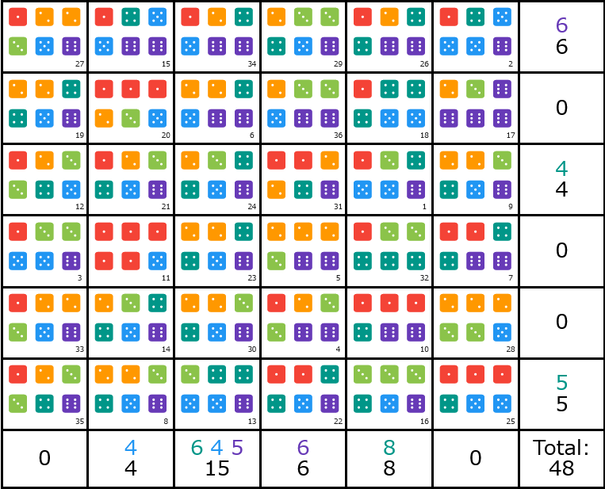

## 문제 설명

이 문제는 わんど氏 (Twitter: [@wand_125](https://twitter.com/wand_125))가 고안한 게임인 セクスタプル을 스코어 문제로 만든 것입니다.

セクスタプル은 다음 규칙을 따르는 $1$인용 게임입니다.

- 다음 조작을 $36$회 반복합니다.
  - 조작: $6$면체 주사위 $6$개를 동시에 굴려 $6\times6$ 표의 아직 배치하지 않은 셀 중 $1$개에 배치합니다.
- $36$회의 조작을 끝낸 뒤 각 행과 각 열에 대해 다음 점수를 얻습니다.
  - 그 행 또는 열의 모든 셀에 나타나는 눈이 있으면, 눈의 종류마다 $3$점을 얻습니다.
  - 그러한 눈에 대해 주사위가 추가로 $1$개 나타날 때마다 $1$점을 더 얻습니다.

[セクスタプル을 플레이할 수 있는 페이지(고안자가 작성)](https://wandsbox125.web.app/game/sextaple/)

이 문제에서는 처음에 모든 주사위 눈이 입력으로 주어집니다.

$36$회 각각에 대해 주사위를 배치할 셀을 정하여 가능한 한 높은 점수를 얻으세요.

테스트 케이스는 $100$개입니다. 각 테스트 케이스의 점수 합이 제출의 점수가 됩니다.

## 입력

```text
$d_{1,1}\ d_{1,2}\ d_{1,3}\ d_{1,4}\ d_{1,5}\ d_{1,6}$
$d_{2,1}\ d_{2,2}\ d_{2,3}\ d_{2,4}\ d_{2,5}\ d_{2,6}$
$\vdots$
$d_{36,1}\ d_{36,2}\ d_{36,3}\ d_{36,4}\ d_{36,5}\ d_{36,6}$
```

$d_{i,j}$는 $i$번째 조작에서 $j$번째 주사위의 눈이며, $1\le d_{i,j}\le6$을 만족하는 정수 중에서 같은 확률로 무작위 선택됩니다.

## 출력

$36$줄을 출력하세요. $i$번째 조작의 주사위 눈을 $x_i$행 $y_i$열의 셀에 배치할 때, $i$번째 줄에 $x_i$와 $y_i$를 공백으로 구분하여 출력하세요.

$x_i,y_i$는 $1\le x_i,y_i\le6$을 만족하는 정수여야 하며, $i\ne j$일 때 $(x_i,y_i)\ne(x_j,y_j)$여야 합니다.

## 예제

### 예제 1 {file=""}

#### 입력

```text
4 1 3 5 6 5
1 5 5 5 6 4
6 3 5 3 5 1
6 1 3 6 3 2
2 6 2 3 2 6
2 4 2 6 6 5
1 6 4 1 6 4
4 5 3 6 2 2
3 2 6 4 2 5
6 1 1 1 4 6
1 1 1 1 5 1
3 2 4 1 3 5
4 3 5 6 4 5
6 3 4 2 4 5
6 6 5 4 5 1
6 3 3 4 5 3
6 2 6 6 6 3
4 5 5 4 4 1
2 6 5 2 4 4
1 1 1 2 5 3
4 6 1 5 3 2
6 5 1 1 4 4
2 4 4 2 5 6
3 5 2 6 4 4
1 5 1 5 4 1
2 4 6 6 4 1
3 2 2 5 6 1
3 2 5 2 2 3
4 6 2 3 3 5
2 5 4 6 3 2
6 1 2 4 1 2
3 3 1 4 4 4
2 5 6 1 2 3
5 2 4 6 1 6
6 4 3 1 3 2
6 5 3 2 3 6
```

#### 출력

```text
3 5
1 6
4 1
5 4
4 4
2 3
4 6
6 2
3 6
5 5
4 2
3 1
6 3
5 2
1 2
6 5
2 6
2 5
2 1
2 2
3 2
6 4
4 3
3 3
6 6
1 5
1 1
5 6
1 4
5 3
3 4
4 5
5 1
1 3
6 1
2 4
```

다음 이미지와 같은 보드가 됩니다. 점수는 $48$점입니다.


