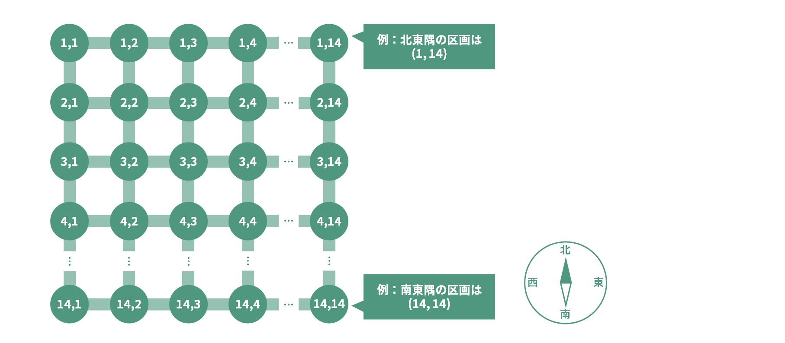
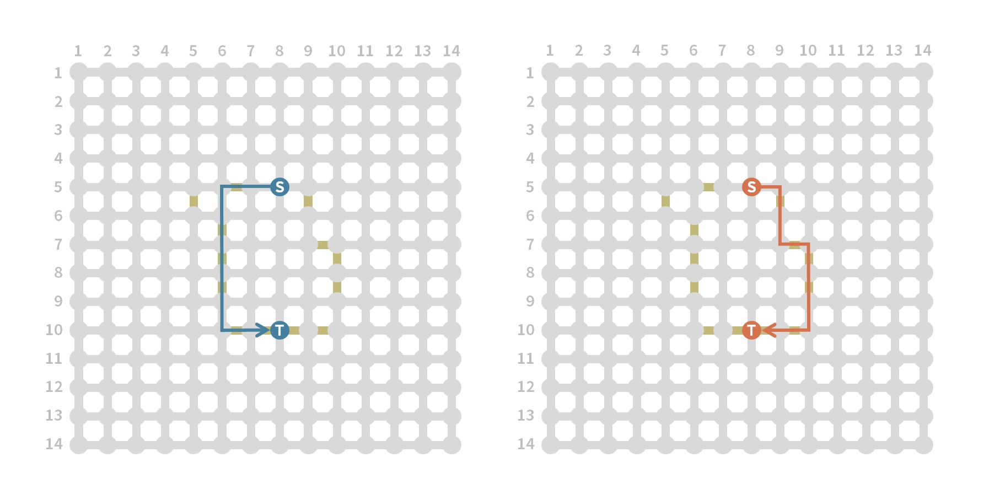

## 문제 설명

KYOPRO시는 세로 $14$행, 가로 $14$열의 정사각형 모양 도시입니다. 북쪽에서 $i$번째 행, 서쪽에서 $j$번째 열에 있는 구획에는 $(i,j)$라는 번호가 붙어 있으며, 동서남북으로 인접한 구획 사이는 도로로 연결되어 있습니다. 즉, KYOPRO시의 구조는 아래 그림과 같습니다.

시민 $N$명이 KYOPRO시에 살고 있으며, 시민에게는 각각 $1$부터 $N$까지 번호가 붙어 있습니다. 시민 $k$의 집은 구획 $(A_k,B_k)$에 있고 회사는 구획 $(C_k,D_k)$에 있습니다.



이미지 안의 표기는 다음과 같습니다: `例：北東隅の区画は (1,14)`는 “예: 북동쪽 모서리의 구획은 $(1,14)$”를, `例：南東隅の区画は (14,14)`는 “예: 남동쪽 모서리의 구획은 $(14,14)$”를 뜻합니다. 방향 표기 `北`, `西`, `東`, `南`은 각각 북, 서, 동, 남입니다.

처음에 KYOPRO시에 건설된 도로는 모두 **일반 도로**이며, 도로 $1$개를 통과하는 데 $1$분이 걸립니다. 그래서 시장인 太郎君은 일부 도로를 **고속도로**($0.223$분에 통과할 수 있음)로 업그레이드하여 이동 시간을 줄이려고 합니다.

구체적으로 太郎君은 남은 임기 $T$일 동안 매일 다음 행동을 순서대로 수행합니다. 단, 처음에 가지고 있는 자금은 $10^6$엔이고 협력자 수는 $1$명입니다.

**$1$단계: 다음 행동 중 $1$개를 선택합니다.**

   - 고속도로 건설: 구획 $(x,y)$와 구획 $(z,w)$를 연결하는 도로를 고속도로로 만듭니다. 비용은 $\left\lfloor 10^7 \div \sqrt{\text{협력자 수}}\right\rfloor$엔입니다.
   - 협력자 모집: 협력자 수가 $1$명 늘어납니다.
   - 자금 모으기: 가진 자금이 $50\,000$엔 늘어납니다.

**$2$단계: 고속도로 수익을 받습니다.**

   - 고속도로를 $1$개 통과하는 데 $30$엔이 들고, 각 시민은 반드시 가장 짧은 시간으로 통근합니다.
   - 따라서 시민 $k$($1 \le k \le N$)가 집에서 회사까지 가는 최단 경로에 포함된 고속도로의 수를 $s_k$라고 하면, $60(s_1+\cdots+s_N)$엔을 받습니다.

太郎君의 진정한 목표는 도시를 편리하게 만드는 것도 도시의 재정을 건전하게 만드는 것도 아니고 돈을 버는 것이므로, 최종 보유 자금을 최대한 크게 하고 싶습니다. 최종 보유 자금을 최대한 크게 하는 太郎君의 행동을 출력하세요.

각 시민이 $2$단계에서 지나는 경로에는 여러 가지가 있을 수 있지만, 최단 시간으로 이동할 때 지나는 고속도로의 수는 이 문제의 제한 아래에서 유일하다는 점에 주의하세요.

예를 들어 아래 그림에서 노란색 도로가 고속도로라면, $S$에서 $T$까지 최단 시간($4.338$분)으로 이동하는 방법은 $2$가지가 있지만 어느 방법이든 고속도로를 $6$개 지난다는 점은 같습니다.



## 입력

**이 문제는 인터랙티브 문제입니다. 일반적인 문제와 입출력 형식이 다르다는 점에 주의하세요.**

먼저 다음 형식으로 $N+1$줄의 입력을 받습니다.

```text
$N\ T$
$A_1\ B_1\ C_1\ D_1$
$A_2\ B_2\ C_2\ D_2$
$\vdots$
$A_N\ B_N\ C_N\ D_N$
```

그다음 $T$회에 걸쳐 다음 (가), (나)를 이 순서대로 반복합니다.

**(가) 현재 보유 자금이 $u$, 현재 협력자 수가 $v$일 때 다음 형식으로 입력을 받습니다.**

```text
$u\ v$
```

## 제한

- $N=3\,000$
- $T=400$
- $1 \le A_k,B_k,C_k,D_k \le 14$ ($1 \le k \le N$)
- $(A_k,B_k)=(C_k,D_k)$인 경우도 있습니다.

## 출력

**(나) 太郎君의 행동을 출력합니다.**

고속도로를 건설하는 경우, 구획 $(x,y)$와 구획 $(z,w)$를 연결하는 고속도로를 다음 형식으로 출력합니다. 이때 $|x-z|+|y-w|=1$을 만족해야 합니다.

```text
$1\ x\ y\ z\ w$
```

협력자를 모집하는 경우 다음 형식으로 출력합니다.

```text
$2$
```

자금을 모으는 경우 다음 형식으로 출력합니다.

```text
$3$
```

## 점수

최종 보유 자금이 그대로 점수가 됩니다. 예를 들어 최종 보유 자금이 $5$억 엔이면 $5$억 점을 얻습니다.

잘못된 출력을 하면 `WA`로 판정됩니다. 잘못된 출력은 다음을 말합니다.

- 출력 형식을 따르지 않은 경우
- 자금이 부족한데 고속도로를 건설한 경우
- 구획 $(x,y)$와 구획 $(z,w)$를 연결하는 고속도로를 건설하려 했지만 $|x-z|+|y-w|=1$을 만족하지 않는 경우
- 구획 $(x,y)$와 구획 $(z,w)$를 연결하는 고속도로를 건설하려 했지만 $1 \le x,y,z,w \le 14$를 만족하지 않는 경우

도중에 잘못된 출력을 했다면 다음 턴의 입력 단계 **(가)**에서 $-1\ -1$을 입력받게 되므로 즉시 프로그램을 종료하세요. 프로그램을 종료하지 않으면 채점 결과가 `TLE`, `RE` 등의 다른 오류가 될 수도 있습니다.

이미 고속도로를 건설한 곳에 고속도로를 건설하려고 해도 오답으로 판정되지는 않지만, 무의미하다는 점에 주의하세요.

테스트 케이스는 총 $50$개이며, 모든 테스트 케이스 점수의 합이 제출 점수입니다. 대회 시간 중 얻은 최고 점수로 최종 순위가 결정되며, 대회 종료 후 시스템 테스트는 실시되지 않습니다.

## 샘플 코드 / 힌트

**휴리스틱 초보자는 이 항목을 읽어 보는 것을 권장합니다.**

인터랙티브 문제에 익숙하지 않은 분들을 위해 C++와 Python 샘플 코드를 다음에 제시합니다. 이 프로그램은 모든 날에 자금을 모읍니다.

- C++: [샘플 코드](https://ideone.com/fOe370)
- Python: [샘플 코드](https://ideone.com/0V3lEB)

또한 이 문제에서는 입력으로 ‘현재 자금’과 ‘현재 협력자 수’를 받을 수 있으므로, 반드시 ‘고속도로 수익이 얼마인지’를 직접 계산할 필요는 없다는 점에 주의하세요.

## 테스트 케이스 생성 방법

**이 항목은 문제를 이해하는 데 필수적이지 않다는 점에 주의하세요.**

테스트 케이스는 다음과 같은 방법으로 생성됩니다.

1. 각 $(p,q)$($1 \le p \le 14$, $1 \le q \le 14$)에 대해 평균 $0$, 표준 편차 $1$인 난수 $e_{p,q}$를 생성합니다.
2. 각 $k$($1 \le k \le N$)에 대해 $(A_k,B_k)$를 생성합니다. $(A_k,B_k)=(p,q)$일 확률은 $3^{e_{p,q}}$에 비례합니다.
3. 각 $k$($1 \le k \le N$)에 대해 $(C_k,D_k)$를 생성합니다. $(C_k,D_k)=(p,q)$일 확률은 $3^{e_{p,q}}$에 비례합니다.

## 예제

**샘플은 제한과 달리 $N=5$, $T=4$이고 처음 보유 자금도 $2\,000$만 엔이라는 점에 주의하세요.**

### 예제 1 {file=""}

#### 입력

```text
5 4
1 1 14 14
2 2 13 13
3 3 12 12
4 4 11 11
5 5 10 10
20000000 1
```

#### 출력

```text
2
```

#### 입력

```text
20000000 2
```

#### 출력

```text
3
```

#### 입력

```text
20050000 2
```

#### 출력

```text
1 4 4 5 4
```

#### 입력

```text
12979173 2
```

#### 출력

```text
3
```

최종 점수는 $13\,029\,413$점입니다. 시민 $1$, $2$, $3$, $4$는 통근할 때 $3$턴째에 건설한 고속도로를 지나므로, $4$턴째 시작 시 보유 자금은
$20\,050\,000-\left\lfloor 10\,000\,000\div\sqrt{2}\right\rfloor+(60\times4)=12\,979\,173$엔입니다.

### 예제 2 {file=""}

#### 입력

```text
5 4
1 1 14 14
2 2 13 13
3 3 12 12
4 4 11 11
5 5 10 10
20000000 1
```

#### 출력

```text
4
```

#### 입력

```text
-1 -1
```

사용자가 잘못된 출력을 하면 $-1\ -1$을 입력받는다는 점에 주의하세요. 테스트 케이스 자체는 예제 $1$과 같습니다.

### 기타 예제 {file=""}

제한을 만족하는 테스트 케이스의 예를 다음에 제시합니다. 입력은 $N$, $T$, $A_k$, $B_k$, $C_k$, $D_k$만 포함한다는 점에 주의하세요.

- [in0.txt](https://drive.google.com/file/d/1aBXZiR7ur4ZKYJwWcjjInmLiVUoRDM0n/view?usp=sharing)
