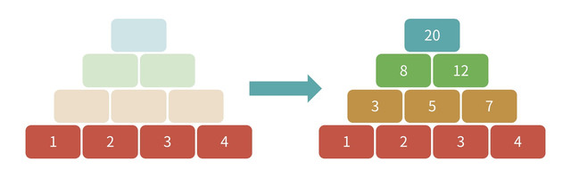

## 공지

실행 시간 제한은 $2$초이지만, 저지의 상태에 따라 약 $0.1$초 정도 달라질 수 있으므로 주의하세요.

실행 시간이 거의 한계에 이른 경우 **저지의 상태에 따라 도중에 `TLE 47/50`과 같이 표시될 수 있지만**, 실행 시간이 대략 $1.85$초 이하라면 다시 실행했을 때 `AC`가 됩니다.

이 대회의 제한 시간은 일반적인 AHC와 달리 $3$시간입니다. 착각하지 않도록 주의하세요.

## 이야기

여러분은 덧셈 피라미드를 알고 있나요?

덧셈 피라미드는 아래 그림처럼 먼저 가장 아래 단에 수를 쓰고, 그다음 위 단에 아래쪽의 $2$개의 수의 합을 써 나가는 퍼즐입니다.



## 문제 설명

이번에는 덧셈 피라미드를 $\mathrm{mod}\ 10^8$에서 계산한다고 합시다.

즉, 가장 아래 단에는 $0$ 이상 $10^8$ 미만의 정수만 쓰고, 계산 도중 수가 $10^8$ 이상이 되면 $10^8$로 나눈 나머지를 취합니다.

각 $(i,j)$ $(1 \leq j \leq i \leq N)$에 대해 위에서 $i$번째 단, 왼쪽에서 $j$번째 열의 수가 $a_{i,j}$가 되도록 가장 아래 단에 수를 쓰고 싶습니다.

하지만 어쩌면 이것은 불가능할 수도 있습니다.

따라서 가장 큰 오차가 발생하는 칸의 오차가 가능한 한 작아지도록 가장 아래 단에 수를 쓰세요.

단, 정수 $a$와 $b$의 오차는 **일반적인 방법과 다르게 다음과 같이** 계산합니다.

- $|a-b|$와 $10^8-|a-b|$ 중 작은 값입니다. (특히 $0$과 $99\,999\,999$의 오차는 $1$입니다.)

### 점수

덧셈 피라미드의 계산을 끝냈을 때 칸 $(i,j)$에 쓰인 값을 $b_{i,j}$라고 합니다. $a_{i,j}$와 $b_{i,j}$의 오차를 $e_{i,j}$라고 하고, 그 최댓값을 $X$라고 합니다.

이때 점수는 $5 \times 10^7-X$점입니다.

**문제 설명에 적힌 대로 오차의 계산 방법이 일반적인 방법과 다르다는 점에 주의하세요.**

테스트 케이스는 총 $50$개이며, 각 테스트 케이스의 점수 합이 제출 점수가 됩니다.

단, $1$개 이상의 테스트 케이스에서 잘못된 출력이나 실행 시간 제한 초과가 발생하면 제출 전체가 `WA` 또는 `TLE`가 됩니다.

각 참가자의 점수는 문제의 「점수순」 탭에서 확인할 수 있습니다.

## 입력

```text
$N$
$a_{1,1}$
$a_{2,1}\ a_{2,2}$
$\vdots$
$a_{N,1}\ a_{N,2}\ \cdots\ a_{N,N}$
```

## 제한

- $N=50$
- $0 \leq a_{i,j} < 10^8$ $(1 \leq j \leq i \leq N)$
- 입력되는 값은 모두 정수입니다.

## 출력

가장 아래 단의 왼쪽에서 $i$번째에 쓸 수를 $c_i$라고 할 때, 다음 형식으로 출력하세요.

```text
$c_1\ c_2\ \cdots\ c_N$
```

(20:51 추가) 출력이 $N$개 미만이면 `AC`로 판정되고 나머지 출력이 $0$으로 처리되는 오류가 있었지만, `WA`가 되도록 저지를 수정했습니다.

## 입력 생성 방법

입력은 다음 방법으로 생성됩니다.

- $a_{i,j}$는 $0$ 이상 $10^8$ 미만의 정수 중에서 균일하게 무작위로 선택됩니다.

## 도구류

샘플 입력 $100$개, 입력 생성 코드, 로컬 테스터(C++ / Python), 샘플 코드(C++ / Python)는 다음 URL에서 확인할 수 있습니다.

- [https://drive.google.com/file/d/1Cmrn7A2g63RuiAylQA8Sm7CJTQyhCGju/view?usp=sharing](https://drive.google.com/file/d/1Cmrn7A2g63RuiAylQA8Sm7CJTQyhCGju/view?usp=sharing)
