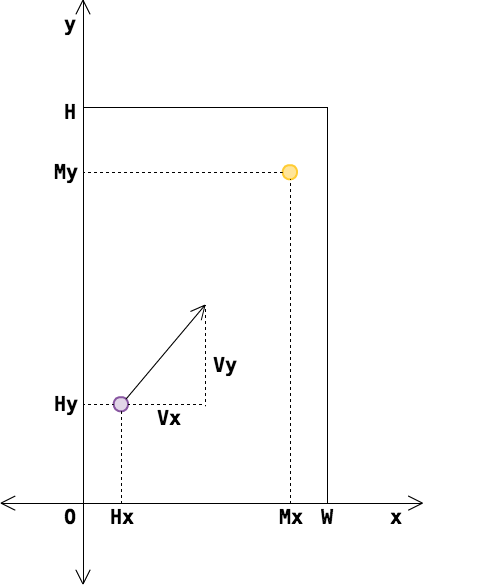

이 문제는 [No.61 리벨리온](http://yukicoder.me/problems/113)의 제약을 강화한 문제입니다.

## 문제 설명

$2$명의 마법소녀 Mami와 Homura는 너비 $W$미터, 깊이 $H$미터인 직사각형 밀실에서 총격전을 벌이고 있었습니다.

Homura는 시간을 멈추는 동시에 최후의 $1$발을 쏩니다. 시간이 멈춘 세계에서는 Homura와 총알만 움직일 수 있습니다. 총알은 벽에 부딪힐 때 입사각과 반사각이 같고 속도가 줄지 않으며, 영원히 날아갑니다.

Mami의 위치 $(M_x,M_y)$, Homura가 발사한 위치 $(H_x,H_y)$, 총알 발사 시의 속도 벡터 $(V_x,V_y)$, 시간이 멈추는 시간 $D$가 주어집니다. 총알이 $D$초 이내에 Mami에게 맞는지 판정하세요.

Mami와 총알의 크기는 무시합니다. Homura는 자신의 총알에 맞지 않습니다.



그림: 배치 예시

## 입력

$1$번째 줄에 질의 수 $Q$가 주어집니다. 이어지는 $Q$개 줄에 각 질의가 주어집니다. 입력은 다음 형식입니다.

본문에서 사용하는 $W,H,D,M_x,M_y,H_x,H_y,V_x,V_y$는 $i$번째 질의에서 각각 $W_i,H_i,D_i,M_{xi},M_{yi},H_{xi},H_{yi},V_{xi},V_{yi}$로 나타냅니다.

```text
$Q$
$W_1\ H_1\ D_1\ M_{x1}\ M_{y1}\ H_{x1}\ H_{y1}\ V_{x1}\ V_{y1}$
$W_2\ H_2\ D_2\ M_{x2}\ M_{y2}\ H_{x2}\ H_{y2}\ V_{x2}\ V_{y2}$
$\vdots$
$W_Q\ H_Q\ D_Q\ M_{xQ}\ M_{yQ}\ H_{xQ}\ H_{yQ}\ V_{xQ}\ V_{yQ}$
```

모든 값은 정수이며, 각 질의의 값은 공백으로 구분되어 주어집니다.

## 제한

- $1 \le Q \le 10\,000$
- $2 \le W,H \le 1\,000\,000\,000$
- $1 \le D \le 1\,000\,000\,000$
- $0 < M_x,H_x < W$
- $0 < M_y,H_y < H$
- $-1\,000\,000\,000 \le V_x,V_y \le 1\,000\,000\,000$
- Mami와 Homura의 위치는 서로 다릅니다.
- $(V_x,V_y) \ne (0,0)$


## 출력

각 질의에 대해 총알이 Mami에게 맞으면 `Hit`, 맞지 않으면 `Miss`를 $1$줄에 $1$개씩 출력하세요. 마지막에 줄바꿈 문자를 출력하세요.

## 예제

### 예제 1 {file=""}

#### 입력

```text
5
9 9 74 7 6 4 1 -5 2
7 11 30 5 4 5 10 13 8
15 4 17 10 3 12 3 -3 1
3 9 22 2 2 1 1 13 12
8 11 2 6 5 1 9 -2 -4
```

#### 출력

```text
Miss
Hit
Miss
Miss
Miss
```

### 예제 2 {file=""}

#### 입력

```text
5
2 15 19 1 2 1 4 1 5
5 5 11 3 1 4 2 9 -7
13 6 68 8 2 11 2 -13 0
2 15 90 1 2 1 8 0 -7
11 4 77 9 1 10 1 -6 13
```

#### 출력

```text
Miss
Miss
Hit
Hit
Miss
```
