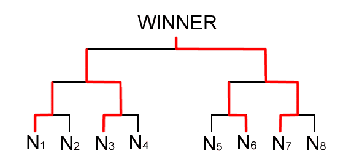

## 문제 설명

타로군은 「빛나라☆전국 타코야키 컵」에 참가하게 되었습니다.

이 대회에는 총 $2^M$명의 선수가 참가합니다. 토너먼트 방식으로 경기하며, 이긴 선수가 다음 라운드에서 살아남은 다른 선수와 경기하는 방식으로 우승자를 정합니다.

$2^M$명의 선수에게는 각각 $N_1$부터 $N_{2^M}$까지 선수 번호가 배정되어 있고, 타로군에게는 $N_1$번이 배정되었습니다.

다음은 $M=3$인 대진표의 예입니다.



토너먼트의 $1$라운드에서는 $N_{2j-1}$번 선수와 $N_{2j}$번 선수가 경기합니다. $(1 \le j \le 2^{M-1})$

각 경기의 승자를 $N'_j$번 선수라고 하면, $2$라운드에서는 $N'_{2k-1}$번 선수와 $N'_{2k}$번 선수가 경기합니다. $(1 \le k \le 2^{M-2})$ 이와 같은 방식으로 총 $M$라운드를 진행하여 우승자 한 명을 정합니다.

$2^M$명의 선수는 각각 강함을 나타내는 매개변수 $S_i$를 가집니다. 어떤 $A$번 선수와 $B$번 선수가 경기할 때 강함이 각각 $S_a,S_b$라면, $A$번 선수가 이길 확률 $P_a$와 $B$번 선수가 이길 확률 $P_b$는 다음과 같습니다.

$P_a = {S_a}^2 / ({S_a}^2+{S_b}^2)$, $P_b = {S_b}^2 / ({S_a}^2+{S_b}^2)$

선수 간 상성 등 위에서 설명한 요소 이외의 요소는 승패에 영향을 주지 않습니다.

$2^M$명의 선수의 강함 매개변수가 주어질 때, 타로군이 우승할 확률을 구하세요.

## 입력

```text
$M$
$S_1$
$\vdots$
$S_{2^M}$
```

## 제한

- 입력으로 주어지는 모든 수는 정수입니다.
- $1 \le M \le 10$
- $1 \le S_i \le 30\,000$ $(1 \le i \le 2^M)$

## 출력

타로군이 우승할 확률을 $0$ 이상 $1$ 이하의 소수로 출력하세요.

절대 오차 또는 상대 오차 중 적어도 하나가 $10^{-6}$ 이하이면 정답으로 인정합니다.

마지막에 줄 바꿈을 출력하세요.

## 예제

### 예제 1 {file=""}

#### 입력

```text
2
1
2
3
4
```

#### 출력

```text
0.0147294
```

$1$라운드에서 타로군 $N_1$번 선수(강함 $1$)와 $N_2$번 선수(강함 $2$)가 경기합니다. 타로군이 이길 확률은 $1^2/(1^2+2^2)=0.2$, 상대가 이길 확률은 $2^2/(1^2+2^2)=0.8$입니다. 같은 방식으로 $N_3$번 선수(강함 $3$)와 $N_4$번 선수(강함 $4$)가 경기하여, 이길 확률은 각각 $3^2/(3^2+4^2)=0.36$과 $4^2/(3^2+4^2)=0.64$입니다.

$2$라운드에서 타로군은 $N_3$번 선수(강함 $3$) 또는 $N_4$번 선수(강함 $4$) 중 이긴 선수와 경기합니다. 타로군이 $N_3$번 선수에게 이길 확률은 $1^2/(1^2+3^2)=0.1$이고, $N_4$번 선수에게 이길 확률은 $1^2/(1^2+4^2)=0.0588235$입니다. 따라서 $2$라운드를 이길 확률은 $0.36 \times 0.1 + 0.64 \times 0.0588235=0.0736467$입니다. 여기에 $1$라운드를 통과할 확률 $0.2$를 곱하면 타로군이 우승할 확률 $0.0147294$를 얻습니다.

### 예제 2 {file=""}

#### 입력

```text
1
3000
2995
```

#### 출력

```text
0.5008340
```
