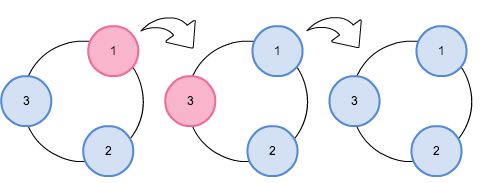

## 이야기

貯金箱くん은 매우 지루했습니다.

그래서 가지고 있는 동전을 가지고 놀기로 했습니다.

## 문제 설명

먼저 가지고 있던 동전을 바닥에 흩뿌린 뒤, 그중 $N$개를 골라 원형으로 배열합니다.

다음으로 $N$개의 동전 중 $1$개를 임의로 선택합니다. 선택한 동전의 액면가가 $D$엔이라면, 선택한 동전에서 시계 방향으로 $D$개 앞에 있는 동전과 반시계 방향으로 $D$개 앞에 있는 동전을 뒤집습니다.

시계 방향과 반시계 방향에서 같은 동전이 선택되는 경우에는 그 동전을 $1$번만 뒤집습니다.

貯金箱くん은 이 조작을 반복하여 모든 동전을 앞면으로 만들려고 합니다.

동전의 배열, 액면가, 처음 앞뒷면 상태가 주어질 때 모든 동전을 앞면으로 만들 수 있는지 판정하세요.

같은 동전을 여러 번 선택해도 됩니다.

## 입력

```text
$N$
$D_1\ D_2\ D_3\ \dots\ D_N$
$W_1\ W_2\ W_3\ \dots\ W_N$
```

$1$번째 줄에 동전의 개수 $N$이 주어집니다.
$2$번째 줄에 각 동전의 액면가 $D_k$가 $N$개, $3$번째 줄에 앞뒷면 상태 $W_k$가 $N$개 주어집니다. 각 배열은 동전의 시계 방향 순서로 공백으로 구분되어 주어집니다.
모든 입력은 정수이며, $W_k=0$이면 뒷면이고 $W_k=1$이면 앞면입니다.

## 제한

- $3 \le N \le 100$
- $1 \le D_k \le 1\,000$ $(1 \le k \le N)$
- $0 \le W_k \le 1$ $(1 \le k \le N)$

## 출력

모든 동전을 앞면으로 만들 수 있으면 `Yes`, 만들 수 없으면 `No`를 출력하세요.

## 예제

### 예제 1 {file=""}

#### 입력

```text
3
1 2 3
1 1 1
```

#### 출력

```text
Yes
```

처음부터 모든 동전이 앞면이므로 동전을 $1$개도 선택할 필요가 없습니다.

### 예제 2 {file=""}

#### 입력

```text
3
1 2 3
0 1 1
```

#### 출력

```text
Yes
```

먼저 $2$엔 동전을 선택하여 시계 방향으로 $2$개 앞에 있는 $1$엔 동전과 반시계 방향으로 $2$개 앞에 있는 $3$엔 동전을 뒤집습니다. 다음으로 $3$엔 동전을 선택하면 시계 방향과 반시계 방향에서 모두 $3$엔 동전이 선택되므로 $3$엔 동전을 $1$번 뒤집습니다. 그러면 모든 동전이 앞면이 됩니다.

그림: 앞면을 파란색, 뒷면을 분홍색으로 표시한 모습



### 예제 3 {file=""}

#### 입력

```text
3
1 1 1
0 0 0
```

#### 출력

```text
No
```

어떻게 동전을 선택해도 모든 동전을 앞면으로 만들 수 없습니다.
