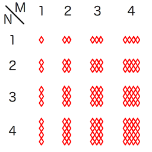

이 문제와 예상 해답은 제가 대체로 맞을 것이라고 예측한 것을 바탕으로 하며, 증명하지 못했습니다.
즉, 증명을 모집하는 문제입니다. 잘 부탁드립니다.

## 문제 설명

어느 마요네즈 봉지에 적힌 그물무늬에 대한 문제입니다.

[어느 마요네즈 참고 이미지](http://www.kewpie.co.jp/products/product.php?j_cd=4901577042072)(외부 사이트)

이 그물무늬가 세로 $N$개 $\times$ 가로 $M$개의 블록으로 구성된 그물무늬라고 할 때, 이 그물무늬를 **교점에서 꺾지 않는 선분만**으로 최소 몇 획에 그릴 수 있는지 구하세요.

가능하다면 설명도 부탁드립니다.



## 입력

```text
$N\ M$
```

입력은 모두 정수로 주어집니다.

## 제한

- $1 \le N \le 1\,000\,000 = 10^6$
- $1 \le M \le 1\,000\,000 = 10^6$

## 출력

그릴 수 있는 최소 획수를 구하세요.

마지막에 개행을 출력하세요.

## 예제

### 예제 1 {file=""}

#### 입력

```text
2 2
```

#### 출력

```text
2
```

이 도형은 교점에서 꺾지 않는 선분만으로는 최소 $2$획이 됩니다.

### 예제 2 {file=""}

#### 입력

```text
2 3
```

#### 출력

```text
1
```

이 도형은 교점에서 꺾지 않는 선분만으로 $1$획에 그릴 수 있습니다.

### 예제 3 {file=""}

#### 입력

```text
4 4
```

#### 출력

```text
4
```

이 도형은 $4$획이나 필요하다고 합니다.
