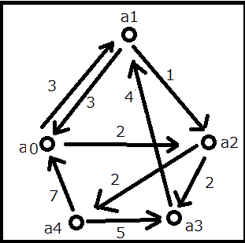
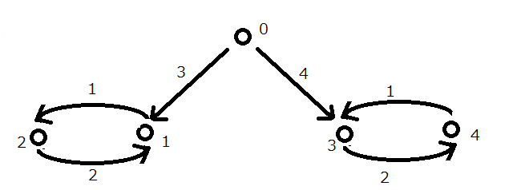
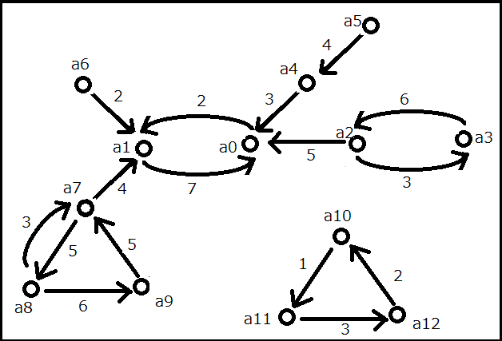

## 이야기

최근 폐지된 Google의 페이지랭크이지만, 아직도 여러 분야에서 사용되는 중요한 기술입니다.
이번에는 페이지랭크의 간이 버전을 구현해 봅니다.

필수는 아니지만 페이지랭크에 대해 조사한 뒤 답을 구하면 지식이 깊어질 수도 있습니다.
Wikipedia 등에 페이지랭크 해설이 있습니다. [Wikipedia: 페이지랭크](https://ja.wikipedia.org/wiki/%E3%83%9A%E3%83%BC%E3%82%B8%E3%83%A9%E3%83%B3%E3%82%AF)

이번에는 웹 페이지에서 사람들이 이동하는 것을 간단히 시뮬레이션한다고 합시다.

## 문제 설명

Google의 페이지랭크를 본떠서, 모든 페이지에 처음부터 $10.0$명이 방문하고 있는 상태에서 계산을 시작합니다.
페이지에는 $0$부터 $n-1$까지 번호를 붙입니다.
페이지를 점으로, 단방향 링크를 화살표로 나타내는 그래프로 생각합니다.
어떤 점에 $0.274481$명처럼 계산된 인원이 있을 수 있습니다.

턴제로 계산하며, $1$번 계산할 때마다 사람들은 현재 머무르고 있는 페이지에서 그 페이지에 있는 $1$개 이상의 링크 중 $1$개를 선택하여 링크의 목적지로 이동합니다.
간이 계산이므로 점에 계속 머무르는 사람도, 중단하는 사람도 없으며, 반드시 매번 계산할 때마다 모든 사람이 다음 링크의 목적지로 이동한다고 합니다.
$100$번 계산한 뒤 각 페이지의 인원을 계산하세요.

페이지와, 그 페이지에 있는 단방향 링크를 따라 다른 페이지로 이동하는 사람의 비율이 주어집니다.
비율에 따라 사람들의 이동을 시뮬레이션하세요.

페이지 아래에서 샘플 입력을 그림과 함께 설명하고 있으므로 이해하기 어렵다면 참고하세요.

## 입력

```text
$n$
$m$
$a_1\ b_1\ c_1$
$\vdots$
$a_m\ b_m\ c_m$
```

데이터셋은 다음과 같이 주어집니다.

- $m$은 페이지를 연결하는 단방향 링크의 수입니다.
- 이어지는 $m$개의 줄에 단방향 링크와 그 링크를 클릭하는 사람의 비율이 정수로 주어집니다.
- $a_i\ b_i\ c_i$
- 페이지 $a_i$에서 페이지 $b_i$로 향하는 사람의 비율은 $c_i$입니다.

페이지 $1$에서 페이지 $2$, $5$, $7$로 향하는 단방향 링크가 있고 각각의 비율이 $3$, $2$, $4$(각 행의 $c_i$ 값)인 경우의 계산 예를 보입니다.

데이터에서 페이지 $1$에서 나가는 링크를 추려 냈을 때 다음과 같다면,

- $1\ 2\ 3$
- $1\ 5\ 2$
- $1\ 7\ 4$

이 데이터라고 합시다.

그 턴의 페이지 $1$ 인원을 $n_1$이라고 하면,

- 페이지 $1$에서 페이지 $2$로 가는 인원은 $\frac{n_1*3.0}{3+2+4}$입니다.
- 페이지 $1$에서 페이지 $5$로 가는 인원은 $\frac{n_1*2.0}{3+2+4}$입니다.
- 페이지 $1$에서 페이지 $7$로 가는 인원은 $\frac{n_1*4.0}{3+2+4}$입니다.

페이지 $1$에 머무르는 사람은 없습니다.
페이지 $1$로 링크하는 페이지가 있다면, 페이지 $1$에는 그 페이지에서 같은 방식으로 계산한 사람들이 옵니다.
이처럼 모든 사람이 모든 점에서 $1$단계 앞의 링크 목적지로 이동하는 것을 계산 $1$회로 합니다.

## 제한

- $1 < n \leq 1\,000$
- $1 < m \leq 10\,000$
- $0 \leq a_i < n$
- $0 \leq b_i < n$
- $a_i \neq b_i$
- $0 < c_i \leq 10$
- 모든 페이지는 반드시 $1$개 이상의 링크를 목적지로 가집니다.
- 어떤 페이지에서도 링크되지 않은 페이지의 인원은 $0$으로 계산됩니다.
- 계산은 `double`형으로 수행합니다.

## 출력

```text
$U_0$
$\vdots$
$U_{n-1}$
```

$100$번 계산이 끝난 뒤 각 점에 있는 인원을 페이지 $0$부터 페이지 $n-1$까지 $1$줄에 $1$개씩 실수 $U_i$로 출력하세요.

오차는 $0.1$까지 허용됩니다.

마지막에 개행을 출력하세요.

## 예제

### 예제 1 {file=""}

#### 입력

```text
5
9
0 1 3
0 2 2
1 0 3
1 2 1
2 3 2
2 4 2
3 1 4
4 3 5
4 0 7
```

#### 출력

```text
14.087019
15.121255
9.415121
6.669044
4.707561
```



그림을 바탕으로 설명합니다.

예를 들어 $1$번째 계산에서 페이지 $a_1$에서 페이지 $a_0$으로 가는 사람 수는 $\frac{10*3}{1+3}$명입니다.

페이지 $a_1$에서 페이지 $a_2$로 가는 사람 수는 $\frac{10*1}{1+3}$명입니다.

페이지 $a_1$로 오는 사람 수는 다음과 같습니다.

- 페이지 $a_3$에서 $\frac{10*4}{4}=10$명
- 페이지 $a_0$에서 $\frac{10*3}{3+2}=6$명

따라서 페이지 $a_1$의 $1$번째 계산이 끝난 시점의 인원은 모두 $16$명입니다.
실제로 페이지에는 $a$ 등이 붙어 있지 않고 정수 번호($0$부터 $n-1$)가 주어집니다.
$a$ 등은 그림을 이해하기 쉽게 하기 위해서만 붙인 것입니다.

참고로 $1$번째 계산이 끝났을 때 각 점의 인원은 다음과 같습니다.

- 페이지 $0$: $13.333333$
- 페이지 $1$: $16.000000$
- 페이지 $2$: $6.500000$
- 페이지 $3$: $9.166667$
- 페이지 $4$: $5.000000$

이를 참고하면 됩니다.

### 예제 2 {file=""}

#### 입력

```text
5
6
0 1 3
0 3 4
1 2 1
2 1 2
3 4 2
4 3 1
```

#### 출력

```text
0.000000
10.000000
14.285714
10.000000
15.714286
```



페이지 $0$은 어디에서도 링크되지 않습니다.
$1$번만 계산해도 페이지 $0$의 인원은 $0$이 됩니다.
페이지에 붙인 $a$는 생략했습니다.
관심이 있다면 $99$번째 계산과 $100$번째 계산 결과를 비교해 보세요.
계산 횟수가 $1$번 차이 나는 것만으로도 각 페이지의 평가가 크게 달라지는 것을 알 수 있습니다.
세상에서 흔히 볼 수 있는 대규모 행렬을 여러 번 적용하면 페이지랭크가 수렴한다는 이야기는, 말하는 만큼 단순하게 생각해서는 안 된다는 것을 알 수 있습니다.

### 예제 3 {file=""}

#### 입력

```text
13
16
0 1 2
1 0 7
2 0 5
2 3 3
3 2 6
4 0 3
5 4 4
6 1 2
7 1 4
7 8 5
8 7 3
8 9 6
9 7 5
10 11 1
11 12 3
12 10 2
```

#### 출력

```text
55.625000
44.375000
0.000000
0.000000
0.000000
0.000000
0.000000
0.000000
0.000000
0.000000
10.000000
10.000000
10.000000
```



네트워크가 $2$개로 나뉘어 있는 경우도 있습니다.
한쪽은 중앙 집중적이어서 페이지 $0$과 페이지 $1$이 모두 차지합니다.
페이지 $2$나 페이지 $7$의 인원은 계산 후 거의 $0$이 되어 가치가 없다고 판단되지만, $2$나 $7$은 높은 가치를 부여할 수는 없어도 다른 페이지에서 링크되어 있으므로 그 나름의 가치는 있어야 합니다.
세상은 단순하지 않다는 것이 드러났고, 간이 계산에는 문제가 있다는 것을 알 수 있습니다.
실무에서는 무엇을 어디까지 어떻게 계산해야 하는지 고민하게 됩니다.
더 나아가 여기서 아무 링크도 하지 않는 페이지에 사람들이 쌓인 경우, 실제 페이지랭크에서는 이를 어떻게 처리하는지 조사해 보면 더욱 좋습니다.
또한 현장에서 계산할 때는 `log`를 사용하지 않으면 계산 정밀도가 의심스러워질 수 있다는 점도 덧붙입니다.
하지만 이번 문제는 간단한 방식으로 체험해 보는 것을 목적으로 하므로, 계산은 지정된 대로 수행하세요.
이상으로 긴 설명을 마치며, 이제 도전해 보세요.
