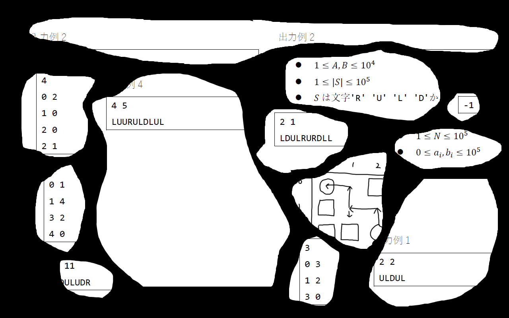

지적을 받아 판정에 오류가 있다는 사실을 알게 되어 수정하고 재채점을 진행했습니다. (2020 10/26 20:30경)

대회 중 제출에 대해서는 판정 결과에 변화가 없음을 확인했습니다.

죄송합니다.

**주의**

이 문제는 다음 문제문의 정보만을 사용하여 AC를 받을 수 있도록 만들어졌습니다.

**특히, 여러 번 제출할 필요가 없습니다. 판정에 지장이 없도록 협조해 주세요.**

또한 문제문에 있는 이미지를 편집 소프트웨어 등으로 조사할 필요도 없습니다.

## 문제 설명

어떤 문제 $1$개를 $2$페이지에 걸쳐 인쇄하여 $2$장 세트의 문제지가 만들어졌습니다.

취급이 좋지 않았기 때문에 이 문제지들이 찢어져 여러 종잇조각이 된 것 같습니다. 게다가 종잇조각 중 몇 장은 사라져 버렸습니다.

남은 종잇조각을 다음 이미지에 모아 두었습니다. 이것들로부터 원래 문제를 추측하여 어떻게든 AC를 받으세요.

단, 준비된 테스트 케이스는 원래 문제의 샘플을 포함하여 섞여 있습니다. (예를 들어 `test_00.in`이 입출력 예제 $1$에 해당한다고 할 수는 없습니다.)

이미지에서 온전히 읽히는 표제와 문장 조각은 다음과 같습니다: 「입력 예제 $2$」, 「출력 예제 $2$」, 「…예제 $4$」, 「…예제 $1$」, $S$는 문자 `R`, `U`, `L`, `D`로…
