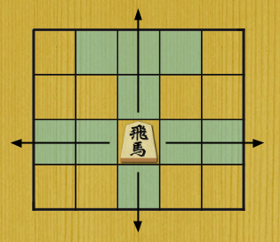
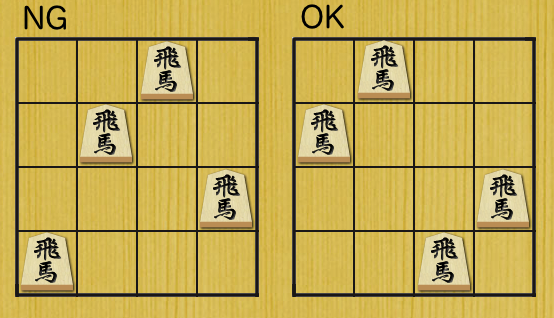

## 문제 설명

나오키군은 $N \times N$칸의 쇼기판과 $N$개의 신기한 말인 “비마”를 가지고 있습니다. 비마는 비차와 계마의 움직임을 함께 가진 말입니다. 세로와 가로로는 몇 칸이든 이동할 수 있습니다.



어느 날 말을 배치하다가, 서로 잡히지 않는 $N$개의 비마 배치가 있다는 것을 발견했습니다.

이 조건을 만족하는 말 배치의 패턴 수를 $10^9+7$로 나눈 나머지를 구하세요.

각 말은 서로 구별되지 않으며, 모두 위쪽을 향하고 있다고 합니다.



## 입력

```text
$N$
```

쇼기판의 한 변의 칸 수이자 말의 개수인 $N$이 주어집니다.

## 제한

$1 \le N \le 1\,000$

## 출력

조건을 만족하는 말 배치의 패턴 수를 $10^9+7$로 나눈 나머지를 출력하세요.

## 예제

### 예제 1 {file=""}

#### 입력

```text
2
```

#### 출력

```text
2
```

### 예제 2 {file=""}

#### 입력

```text
4
```

#### 출력

```text
8
```

### 예제 3 {file=""}

#### 입력

```text
8
```

#### 출력

```text
7208
```

### 예제 4 {file=""}

#### 입력

```text
10
```

#### 출력

```text
605864
```
